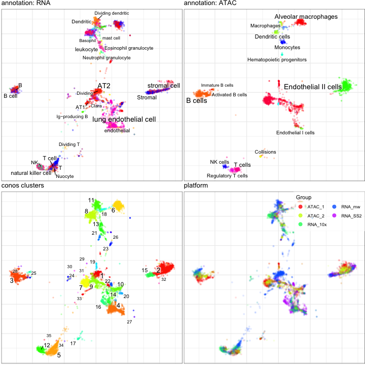

This tutorial walks through an example of RNA-ATAC-seq integration based on the gene activity scores.


## Install Auxilliary Data Packages

First install the auxilliary packages for pagoda2 and conos, [p2data](https://github.com/kharchenkolab/p2data) and [conosPanel](https://github.com/kharchenkolab/conosPanel):


```r
install.packages('p2data', repos='https://kharchenkolab.github.io/drat/', type='source')
install.packages('conosPanel', repos='https://kharchenkolab.github.io/drat/', type='source')
```


Now load the necessary libraries:


```r
library(conos)
library(pagoda2)
library(parallel)
library(ggplot2)
```

Next load the example data and annotations for this tutorial. The data contains lung count matrices from three RNA datasets (two lung samples from Tabula Muris, one lung sample from Han et al.), and two lung sci-ATAC-seq replicates from Cusanovich et al. For sci-ATAC-seq, the matrix values correspond to gene activity scores, as [estimated by the authors using Cicero](http://atlas.gs.washington.edu/mouse-atac/):


```r
load(url("http://pklab.med.harvard.edu/peterk/conos/atac_rna/data.RData"))
```

Let’s take a look at the panel. The panel is a named list of sparse matrices (type `"dgCMatrix"`).


```r
str(data,1)
```

```
## List of 5
##  $ RNA_SS2:Formal class 'dgCMatrix' [package "Matrix"] with 6 slots
##  $ RNA_10x:Formal class 'dgCMatrix' [package "Matrix"] with 6 slots
##  $ RNA_mw :Formal class 'dgCMatrix' [package "Matrix"] with 6 slots
##  $ ATAC_1 :Formal class 'dgCMatrix' [package "Matrix"] with 6 slots
##  $ ATAC_2 :Formal class 'dgCMatrix' [package "Matrix"] with 6 slots
```

Next we perform standard pre-processing using [pagoda2](https://github.com/kharchenkolab/pagoda2):


```r
p2l <- lapply(data,basicP2proc,n.odgenes=3e3,min.cells.per.gene=-1,nPcs=30,make.geneknn=FALSE,n.cores=1)
```

```
## creating space of type angular done
## adding data ... done
## building index ... done
## querying ... done
## creating space of type angular done
## adding data ... done
## building index ... done
## querying ... done
## creating space of type angular done
## adding data ... done
## building index ... done
## querying ... done
## creating space of type angular done
## adding data ... done
## building index ... done
## querying ... done
## creating space of type angular done
## adding data ... done
## building index ... done
## querying ... done
```

Now we perform the basic steps for conos processing:


```r
## instantiate Conos object
con <- Conos$new(p2l, n.cores=1)

## build joint graph
con$buildGraph(k=15, k.self=5, k.self.weigh=0.01, ncomps=30, n.odgenes=5e3, space='PCA') 

## find communities
con$findCommunities(resolution=1.5)

## generate embedding
con$embedGraph(alpha=1/2)
```

We can now plot RNA-seq and ATAC-seq cells separately (on the same embedding), using the annotations provided in the Tabula Muris (for RNA) and sci-ATAC manuscript (for ATAC):


```r
p1 <- con$plotGraph(font.size=c(3,5),title='conos clusters',alpha=0.2) #+ annotate("text", x=-Inf, y = Inf, label = "clusters", vjust=1, hjust=0)

p2 <- con$plotGraph(groups=rna.annotation,mark.groups=TRUE,alpha=0.2,plot.na=FALSE,title='annotation: RNA',font.size=c(3,5))+xlim(range(con$embedding[,1]))+ylim(range(con$embedding[,2]))

p2c <- con$plotGraph(groups=atac.annotation,mark.groups=T,alpha=0.2,plot.na=FALSE,title='annotation: ATAC',font.size=c(3,5))+xlim(range(con$embedding[,1]))+ylim(range(con$embedding[,2]))

p3 <- con$plotGraph(color.by='sample',mark.groups=F,alpha=0.1,show.legend=TRUE,title='platform',raster=TRUE)+theme(legend.position=c(1,1),legend.justification = c(1,1))+guides(color=guide_legend(ncol=2,override.aes = list(size=3,alpha=0.8)))

pp <- cowplot::plot_grid(plotlist=list(p2,p2c,p1,p3), ncol=2) 
print(pp)
```




