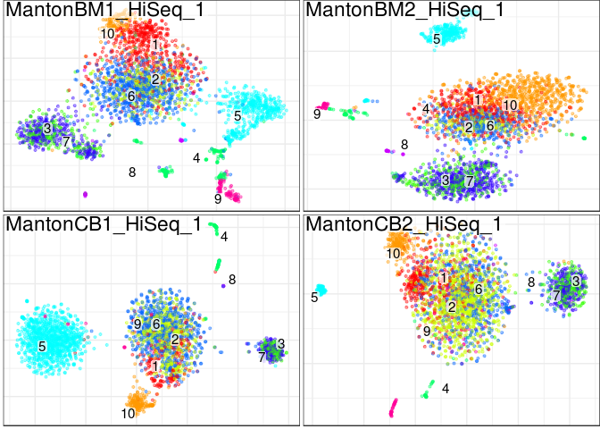
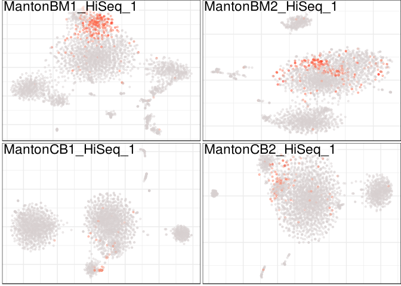
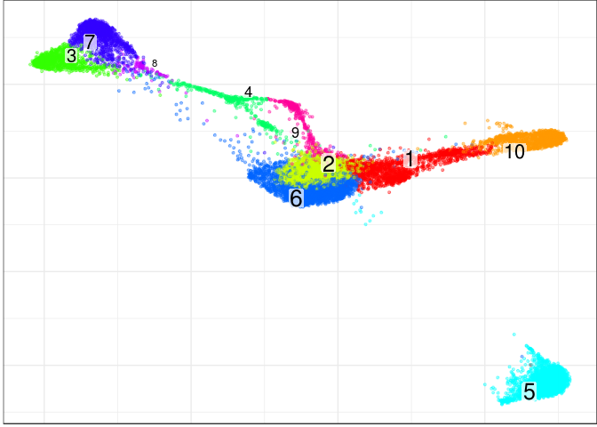
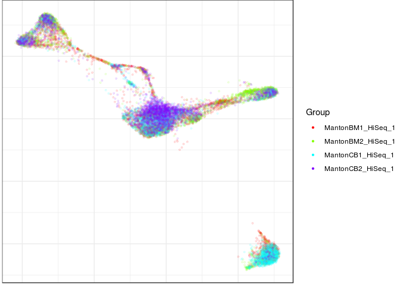
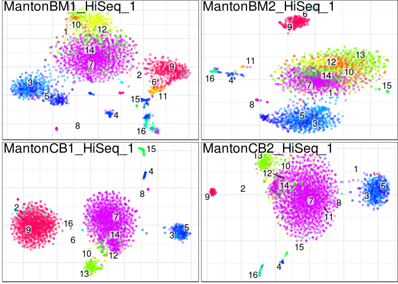
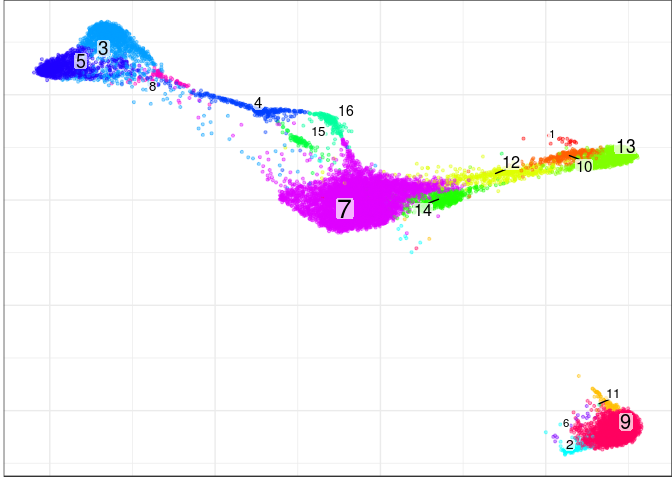
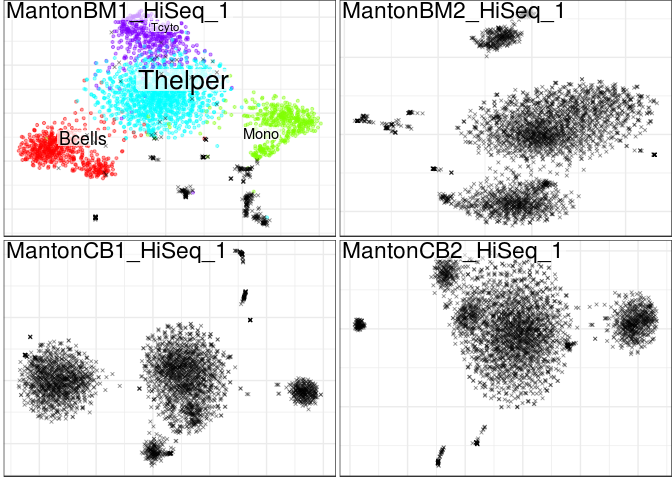
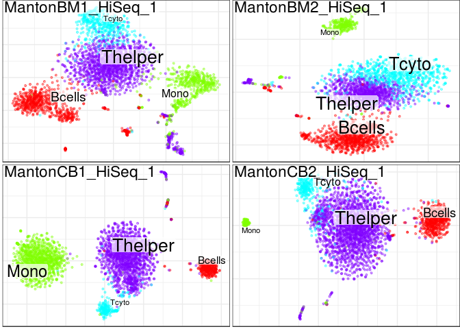

Conos Walkthrough using Seurat
================

In this tutorial we will go over the analysis of a panel of samples using conos. Conos objects can be used to identify clusters of corresponding cells across panels of samples from similar or dissimilar sources, with different degrees of cell type overlap. Here we will identify corresponding clusters accorss a panel of bone marrow (BM) and cord blood (CB) by generating a joint graph with the cells from all the samples. We will use the graph to propagate labels from a single labelled sample to other samples and finally perform differential expression between BM and CM samples.

Preliminary
===========

First of all we need to load the libraries we will use, we will need Seurat, conos and some helper libraries.

``` r
library(Seurat)
library(conos)
library(igraph)
library(nbHelpers)
```

Loading the data
================

Next we will load a previously prepared panel of samples. This panel is made up of 16 cord blood and bone marrow samples. It has already been quality controlled so we don't need to worry about that. All samples have been subset to exactly 3000 cells.

``` r
panel <- readRDS(file.path(find.package('conos'),'extdata','panel.rds'))
```

Let's take a look at the panel. The panel is a named list of sparse matrices (type dgCMatrix).

``` r
str(panel,1)
```

    ## List of 8
    ##  $ MantonBM1_HiSeq_1:Formal class 'dgCMatrix' [package "Matrix"] with 6 slots
    ##  $ MantonBM2_HiSeq_1:Formal class 'dgCMatrix' [package "Matrix"] with 6 slots
    ##  $ MantonBM3_HiSeq_1:Formal class 'dgCMatrix' [package "Matrix"] with 6 slots
    ##  $ MantonBM4_HiSeq_1:Formal class 'dgCMatrix' [package "Matrix"] with 6 slots
    ##  $ MantonCB1_HiSeq_1:Formal class 'dgCMatrix' [package "Matrix"] with 6 slots
    ##  $ MantonCB2_HiSeq_1:Formal class 'dgCMatrix' [package "Matrix"] with 6 slots
    ##  $ MantonCB3_HiSeq_1:Formal class 'dgCMatrix' [package "Matrix"] with 6 slots
    ##  $ MantonCB4_HiSeq_1:Formal class 'dgCMatrix' [package "Matrix"] with 6 slots

Before we continue it is very important to make sure that cells in our panel are uniquely named. No two cells (even in different samples) should be named identically. In this case the cells have been prefixed by sample id, so there will not be any collisions. However in most cases you will have to prefix the cells before continuing.

``` r
head(colnames(panel[[1]]))
```

    ## [1] "MantonBM1_HiSeq_1-TCTATTGGTCTCTCGT-1"
    ## [2] "MantonBM1_HiSeq_1-GAATAAGTCACGCATA-1"
    ## [3] "MantonBM1_HiSeq_1-ACACCGGTCTAACTTC-1"
    ## [4] "MantonBM1_HiSeq_1-TCATTTGGTACGCTGC-1"
    ## [5] "MantonBM1_HiSeq_1-TATTACCCAAAGGAAG-1"
    ## [6] "MantonBM1_HiSeq_1-CGCCAAGCATCTGGTA-1"

Next we will subset the panel to just 4 samples. Conos has been tested with 10s of samples, however larger panel sizes increase running time considerably. For brevity we will only use 2 CB and 2 BM samples. After subsetting we will generate Seurat objects for these four samples using the basicSeuratProc function.

``` r
panel <- panel[c('MantonBM1_HiSeq_1','MantonBM2_HiSeq_1','MantonCB1_HiSeq_1','MantonCB2_HiSeq_1')]
panel.seurat <- lapply(panel, basicSeuratProc)
```

    ## Scaling data matrix
    ## Scaling data matrix
    ## Scaling data matrix

    ## 1 singletons identified. 5 final clusters.

    ## Scaling data matrix

    ## 2 singletons identified. 7 final clusters.

Let's look at the output of our processing. We now have a named list of Seurat objects, which is the starting point for the analysis with Conos.

``` r
str(panel.seurat, 1)
```

    ## List of 4
    ##  $ MantonBM1_HiSeq_1:Formal class 'seurat' [package "Seurat"] with 20 slots
    ##  $ MantonBM2_HiSeq_1:Formal class 'seurat' [package "Seurat"] with 20 slots
    ##  $ MantonCB1_HiSeq_1:Formal class 'seurat' [package "Seurat"] with 20 slots
    ##  $ MantonCB2_HiSeq_1:Formal class 'seurat' [package "Seurat"] with 20 slots

Processing with Conos
=====================

We will now construct a Conos object for this panel of samples. At this point we haven't calculated anything. We have just generated an object that contains the samples. Note that at this step we also set the n.cores parameter. The graph generation with Conos can take advantage of parallel processing, so use as many physical cores as you have available here.

``` r
con <- Conos$new(panel.seurat,n.cores=1)
```

Our original Seurat objects are now saved in the conos object (if you are short of memory you can go ahead and delete the originals).

``` r
str(con$samples,1)
```

    ## List of 4
    ##  $ MantonBM1_HiSeq_1:Formal class 'seurat' [package "Seurat"] with 20 slots
    ##  $ MantonBM2_HiSeq_1:Formal class 'seurat' [package "Seurat"] with 20 slots
    ##  $ MantonCB1_HiSeq_1:Formal class 'seurat' [package "Seurat"] with 20 slots
    ##  $ MantonCB2_HiSeq_1:Formal class 'seurat' [package "Seurat"] with 20 slots

We can now plot a panel of these samples using the clusters we identified by examining each sample on its own. We note that each sample has an independent set of clusters that bears no relationship to clusters in other sample (for example note cluster 9).

``` r
con$plotPanel(clustering="multilevel", use.local.clusters=T, title.size=6)
```

    ## Warning in FUN(X[[i]], ...): Seurat support only single type of clustering

    ## Warning in FUN(X[[i]], ...): Seurat support only single type of clustering

    ## Warning in FUN(X[[i]], ...): Seurat support only single type of clustering

    ## Warning in FUN(X[[i]], ...): Seurat support only single type of clustering


Next we will build the graph emcompasses all the samples. We do that by pairwise projecting samples onto a common space and establishing KNN of mNN pairs between the samples. We then append iwthin sample KNN neighbours to the graph to ensure that all the cell are included in the graph.

``` r
con$buildGraph(k=30, k.self=10, k.self.weight=0.1, space='PCA', matching.method='mNN', metric='angular', 
               data.type='counts', l2.sigma=1e5, var.scale=FALSE, ncomps=50, n.odgenes=1000, return.details=T,
               neighborhood.average=FALSE,neighborhood.average.k=10, exclude.pairs=NULL, exclude.samples=NULL, 
               common.centering=TRUE , verbose=TRUE)
```

    ## found 0 out of 6 cached PCA  space pairs ... running 6 additional PCA  space pairs ...... done
    ## inter-sample links using  mNN  ...... done
    ## local pairs .... done

We next use the graph we identified to get global clusters. Here we use mutlievel to obtain clusters.

``` r
con$findCommunities(method=multilevel.community, min.group.size=0)
```

We can now plot the clusters we obtained. Note that the cluster numbers between different samples now correspond to the same cell type. Also not the presence of cluster 5 in BM samples only, but not in CB.

``` r
con$plotPanel(font.size=4)
```



Check an expression pattern of a specific gene across all the individual embeddings.

``` r
con$plotPanel(gene = 'GZMK')
```



Next we embed and visualize the complete joint graph:

``` r
con$plotGraph()
```

    ## Estimating embeddings.



We note that the graph captures the population structure irrespecively of the sample of origin of each cell.

``` r
con$plotGraph(color.by='sample',mark.groups=F,alpha=0.1,show.legend=T)
```



Other community detection methods can provide a more sensitive and hierarchical view of the subpopulation structure. Here we run walktrap community detection method on the same joint graph:

``` r
con$findCommunities(method = igraph::walktrap.community, steps=4)
```

Visualize new clusters:

``` r
con$plotPanel(clustering='walktrap',font.size=4)
```



New clustering, as viewed on a joint graph:

``` r
con$plotGraph(clustering='walktrap')
```



Label propagation
=================

One of the uses of this graph is to propagate labels. For example in some cases we will only have information about the cell types in one of the samples and we want to automatically label the other samples.

Load cell annotation for one of the samples. Here we are loading annotations we generated with the pagoda2 web tool. We first load the annotations, but because we made the with the lasso tool there is no guarantee that some cells are not included in multiple selctions. For this reason we use removeSelectionOverlaps before conversing the selections to a factor that we can use downstream.

``` r
library(pagoda2)
```

    ## 

    ## 
    ## Attaching package: 'pagoda2'

    ## The following object is masked from 'package:nbHelpers':
    ## 
    ##     namedNames

    ## The following objects are masked from 'package:conos':
    ## 
    ##     buildWijMatrix, projectKNNs

``` r
cellannot <- readPagoda2SelectionFile(file.path(find.package('conos'),'extdata','selections.txt'))
cellannot <- removeSelectionOverlaps(cellannot)
cellannot <- factorFromP2Selection(cellannot)
```

Next we plot our panel with the annotations we made. This is to verify that the annotated cells are indeed in only one sample and that the other samples are unlabelled.

``` r
con$plotPanel(groups = cellannot)
```



Next let's propagaes the labels from the one annotated sample to the other samples.

``` r
tmp.names <- names(cellannot)
cellannot.c <- as.character(cellannot)
names(cellannot.c) <- tmp.names
new.label.probabilities <- con$propagateLabels(labels = cellannot,verbose = T)
```

This function returns probabilites of the cell belonging to each group, we can assign each cell to the the the cell type with the highest probability.

``` r
new.annot <- colnames(new.label.probabilities)[apply(new.label.probabilities,1,which.max)]
names(new.annot) <- rownames(new.label.probabilities)
head(new.annot)
```

    ## MantonBM1_HiSeq_1-ATAGACCCAAAGTCAA-1 MantonBM2_HiSeq_1-CTGATAGAGCGTTCCG-1 
    ##                              "Tcyto"                              "Tcyto" 
    ## MantonBM1_HiSeq_1-GGTGTTACAAATACAG-1 MantonBM2_HiSeq_1-GGAAAGCCAGACGCCT-1 
    ##                              "Tcyto"                              "Tcyto" 
    ## MantonBM1_HiSeq_1-ACACCGGAGTAACCCT-1 MantonBM1_HiSeq_1-AAAGTAGAGTTAGGTA-1 
    ##                              "Tcyto"                              "Tcyto"

We not see that all our samples have been labelled automagically!

``` r
con$plotPanel(groups = new.annot)
```



Differential expression
=======================

Once we have identified a joint clustering of cells that captures cell relationships between samples, we want to ask what is different between the cells of these populations between specific samples types, in this case CB and BM samples. Conos provides routines to be able to do that.

First we need to define our sample groups

``` r
samplegroups <- list(
  bm = c("MantonBM1_HiSeq_1","MantonBM2_HiSeq_1"),
  cb = c("MantonCB1_HiSeq_1","MantonCB2_HiSeq_1")
)
```

We can then run differential expression between cells in these groups

``` r
de.multilevel <- getPerCellTypeDE(con, groups=as.factor(new.annot),sample.groups = samplegroups, ref.level='bm', n.cores=4)
```

...and examine the output

``` r
str(de.multilevel[1:3], 2)
```

    ## List of 3
    ##  $ Bcells:List of 3
    ##   ..$ res         :'data.frame': 33694 obs. of  6 variables:
    ##   ..$ cm          :Formal class 'dgCMatrix' [package "Matrix"] with 6 slots
    ##   ..$ sample.groups:List of 2
    ##  $ Mono  :List of 3
    ##   ..$ res         :'data.frame': 33694 obs. of  6 variables:
    ##   ..$ cm          :Formal class 'dgCMatrix' [package "Matrix"] with 6 slots
    ##   ..$ sample.groups:List of 2
    ##  $ Tcyto :List of 3
    ##   ..$ res         :'data.frame': 33694 obs. of  6 variables:
    ##   ..$ cm          :Formal class 'dgCMatrix' [package "Matrix"] with 6 slots
    ##   ..$ sample.groups:List of 2

Let's look at the results for the Bcells

``` r
res <- de.multilevel[['Bcells']]$res
head(res[order(res$padj,decreasing = FALSE),])
```

    ##         baseMean log2FoldChange     lfcSE       stat       pvalue
    ## IGHA1  2094.8248      -8.141678 0.5234152 -15.554912 1.473570e-54
    ## JCHAIN  760.1903      -4.299006 0.3848416 -11.170846 5.663874e-29
    ## IGKC   8705.8679      -3.645077 0.3820065  -9.541923 1.402074e-21
    ## HBG1    318.6680       5.524080 0.5938488   9.302167 1.376123e-20
    ## IGHG2   163.2012      -5.116896 0.5847507  -8.750560 2.122964e-18
    ## IGHG3   173.6593      -5.218898 0.5993574  -8.707489 3.106810e-18
    ##                padj
    ## IGHA1  2.631944e-50
    ## JCHAIN 5.058123e-25
    ## IGKC   8.347479e-18
    ## HBG1   6.144734e-17
    ## IGHG2  7.583653e-15
    ## IGHG3  9.248456e-15

With correction
---------------

In certain cases we observe that differential expression will result in the similar genes between multiple cell types. This may be due to genuine biological reasons (similar response), due to background, or due to other effects. Conos can calculate a mean expression vector between the two conditions and subtract this from all the comparisons, so observer the cell-type specific effect.

``` r
## Calculate correction
fc.correction <- getCorrectionVector(con, groups=as.factor(new.annot),sample.groups = samplegroups, ref.level='bm', n.cores=4,correction.method='varianceweighted')
fc.correction[is.na(fc.correction)] <- 0

## Use corrected version
de.multilevel.corrected <- getPerCellTypeDECorrected(con, groups=as.factor(new.annot),sample.groups = samplegroups, ref.level='bm', n.cores=4, correction = fc.correction)
```

``` r
res <- as.data.frame(de.multilevel.corrected[['Mono']]$res)
head(res[order(res$padj,decreasing = FALSE),])
```

    ##                  baseMean log2FoldChange     lfcSE       stat       pvalue
    ## IGHG1         382.7984835    -2.62652709 0.3505273 -7.4930751 6.727838e-14
    ## MPO            55.2243158    -2.15591128 0.3505292 -6.1504466 7.726509e-10
    ## VPREB1         45.2781660    -2.07043323 0.3499366 -5.9165961 3.286725e-09
    ## HBG2         6414.9274842     1.60130163 0.3360086  4.7656560 1.882402e-06
    ## RP11-34P13.7    0.4297812    -0.03504064 0.1094168 -0.3202491 7.487795e-01
    ## FO538757.2     32.4788075    -0.05625917 0.3503150 -0.1605959 8.724117e-01
    ##                      padj
    ## IGHG1        1.203543e-09
    ## MPO          6.910976e-06
    ## VPREB1       1.959874e-05
    ## HBG2         8.418572e-03
    ## RP11-34P13.7 9.999965e-01
    ## FO538757.2   9.999965e-01
