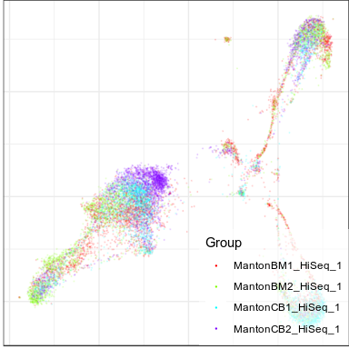
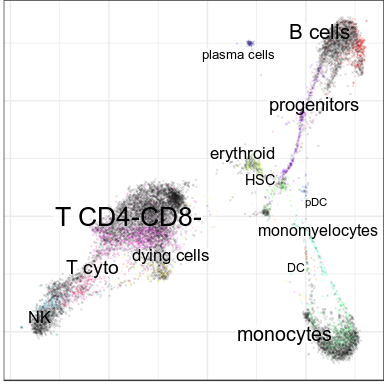
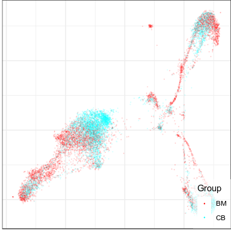
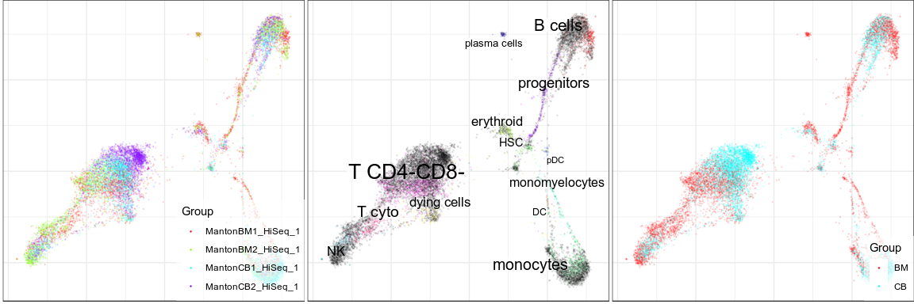
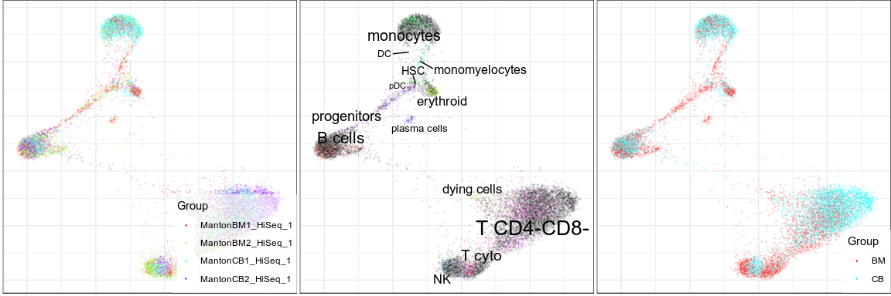
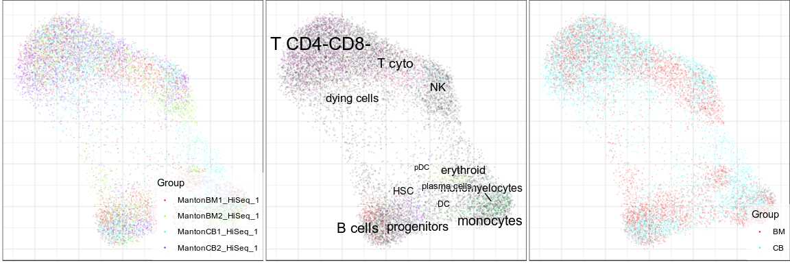
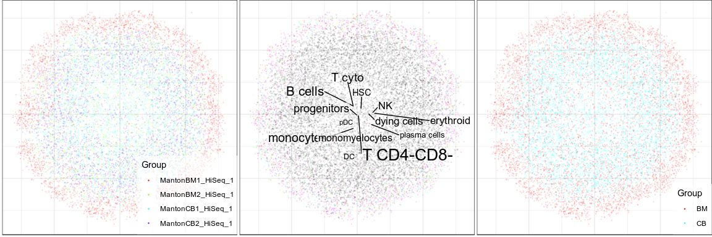
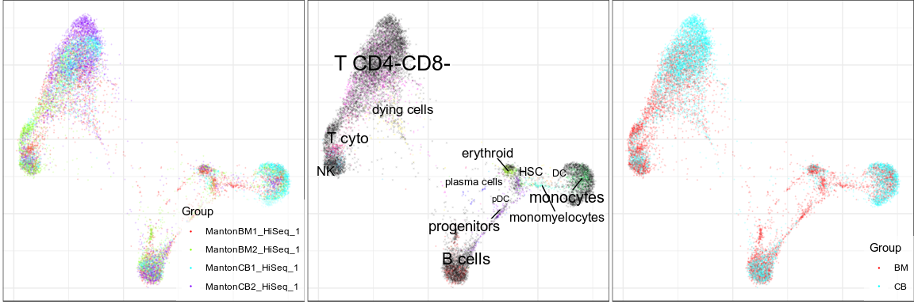

Adjustment of Alignment Strength with Conos
================

This tutorial uses the same data as the main Walkthrough to demonstrate
different options for forcing alignment. It can be especially useful if
the samples are grouped by some external condition (e.g. sequencing
protocol or disease vs control).

## Load and align data

First, let’s load Conos library and corresponding data:

``` r
library(pagoda2)
library(conos)
library(tidyverse)
library(magrittr)

panel <- readRDS(file.path(find.package('conos'),'extdata','panel.rds'))
cellannot <- find.package('conos') %>% file.path('extdata', 'cellannot.txt') %>%
  read.table(header=F,sep='\t') %$% setNames(V2, V1)
```

Then we can pre-process the samples with pagoda and align
it:

``` r
panel.preprocessed <- lapply(panel, basicP2proc, n.cores=4, min.cells.per.gene=0, 
                             n.odgenes=2e3, get.largevis=FALSE, make.geneknn=FALSE)
```

    ## 3000 cells, 33694 genes; normalizing ... using plain model winsorizing ... log scale ... done.
    ## calculating variance fit ... using gam 171 overdispersed genes ... 171 persisting ... done.
    ## running PCA using 2000 OD genes .... done
    ## running tSNE using 4 cores:
    ## 3000 cells, 33694 genes; normalizing ... using plain model winsorizing ... log scale ... done.
    ## calculating variance fit ... using gam 159 overdispersed genes ... 159 persisting ... done.
    ## running PCA using 2000 OD genes .... done
    ## running tSNE using 4 cores:
    ## 3000 cells, 33694 genes; normalizing ... using plain model winsorizing ... log scale ... done.
    ## calculating variance fit ... using gam 248 overdispersed genes ... 248 persisting ... done.
    ## running PCA using 2000 OD genes .... done
    ## running tSNE using 4 cores:
    ## 3000 cells, 33694 genes; normalizing ... using plain model winsorizing ... log scale ... done.
    ## calculating variance fit ... using gam 166 overdispersed genes ... 166 persisting ... done.
    ## running PCA using 2000 OD genes .... done
    ## running tSNE using 4 cores:

``` r
con <- Conos$new(panel.preprocessed, n.cores=4)
con$buildGraph(k=20, k.self=5, space='PCA', ncomps=30)
```

    ## found 0 out of 6 cached PCA  space pairs ... running 6 additional PCA  space pairs  done
    ## inter-sample links using  mNN   done
    ## local pairs local pairs  done
    ## building graph ..done

``` r
con$embedGraph()
```

    ## Estimating embeddings.

``` r
con$plotGraph(color.by='sample', alpha=0.1, size=0.2, mark.groups=F, 
              show.legend=T, legend.pos=c(1, 0))
```

<!-- -->

``` r
con$plotGraph(groups=cellannot, alpha=0.1, size=0.2)
```

<!-- -->

## Force alignment

In this dataset our samples are grouped by tissue (BM vs CB), so we can
color by this factor:

``` r
tissue_per_cb <- con$getDatasetPerCell() %>% substr(7, 8) %>% 
  setNames(names(con$getDatasetPerCell()))

con$plotGraph(groups=tissue_per_cb, alpha=0.1, size=0.2, mark.groups=F, 
              show.legend=T, legend.pos=c(1, 0))
```

<!-- -->

So we can see clear separation. Indeed, it’s a matter of a research
questions, if different tissues must be aligned completely, or if it
should form close, but separate cluster. And one benifit of Conos is
that it gives you option to choose. There are three ways you can force
more aggressive alignment.

Let’s first define function to show changes in Conos
graph:

``` r
plotConosSummary <- function(con, cell.type.annot, tissue.annot, size=0.2, alpha=0.1, legend.pos=c(1, 0)) {
  cowplot::plot_grid(
    con$plotGraph(color.by='sample', alpha=alpha, size=size, mark.groups=F, 
              show.legend=T, legend.pos=legend.pos),
    con$plotGraph(groups=cellannot, alpha=alpha, size=size),
    con$plotGraph(groups=tissue_per_cb, alpha=alpha, size=size, mark.groups=F, 
              show.legend=T, legend.pos=legend.pos),
    ncol=3
    )
}
```

``` r
plotConosSummary(con, cellannot, tissue_per_cb)
```

<!-- -->

### Adjustment of the `alignment.strength` parameter

One problem of such alignments is that more distant cells just can’t
find mutual nearest neighbors in the radius `k`. So Conos can increase
this radius in a way, which gives more possible neighbors to these
isolate cells, trying to hold number of neighbors of cells in the dense
regions on the same level. It can be done through `alignment.strength`
parameter, which can be varied in \[0; 1\] range (default:
0).

``` r
con$buildGraph(k=20, k.self=5, space='PCA', ncomps=30, alignment.strength=0.3)
```

    ## found 6 out of 6 cached PCA  space pairs ...  done
    ## inter-sample links using  mNN   done
    ## local pairs local pairs  done
    ## building graph ..done

``` r
con$embedGraph()
```

    ## Estimating embeddings.

``` r
plotConosSummary(con, cellannot, tissue_per_cb)
```

<!-- -->

Though, be aware that larger values of `alignment.strength` lead to
worse cluster
separation:

``` r
con$buildGraph(k=20, k.self=5, space='PCA', ncomps=30, alignment.strength=0.6)
```

    ## found 6 out of 6 cached PCA  space pairs ...  done
    ## inter-sample links using  mNN   done
    ## local pairs local pairs  done
    ## building graph ..done

``` r
con$embedGraph()
```

    ## Estimating embeddings.

``` r
plotConosSummary(con, cellannot, tissue_per_cb)
```

<!-- -->

With the most extreme case, which actually “aligns” all clusters and
datasets
together:

``` r
con$buildGraph(k=20, k.self=5, space='PCA', ncomps=30, alignment.strength=1.0)
```

    ## found 6 out of 6 cached PCA  space pairs ...  done
    ## inter-sample links using  mNN   done
    ## local pairs local pairs  done
    ## building graph ..done

``` r
con$embedGraph()
```

    ## Estimating embeddings.

``` r
plotConosSummary(con, cellannot, tissue_per_cb)
```

<!-- -->

Still, this procedure isn’t explicitly aware about conditions, which
cause dataset differences. And sometimes it allows datasets to group
together even with the most “aggressive” alignment.

### “Supervised” alignment

To overcome this issue we added possibility to down-weight edges, which
connect cells within the same condition. Parameter, which determines
multiplication coefficient is called `same.factor.downweight`, and it
also requires you to pass information about the conditions to
`balancing.factor.per.cell`. Please keep in mind that down-weighting of
within-tissue edges doesn’t help if there are no between-tissue edges.
So it’s recommended to use `same.factor.downweight` parameter together
with
`alignment.strength`.

``` r
con$buildGraph(k=20, k.self=5, space='PCA', ncomps=30, same.factor.downweight=0.1, 
               balancing.factor.per.cell=tissue_per_cb, alignment.strength=0.3)
```

    ## found 6 out of 6 cached PCA  space pairs ...  done
    ## inter-sample links using  mNN   done
    ## local pairs local pairs  done
    ## building graph ..done
    ## balancing edge weights done

``` r
con$embedGraph()
```

    ## Estimating embeddings.

``` r
plotConosSummary(con, cellannot, tissue_per_cb)
```

<!-- -->
