Conos Walkthrough
================

-   [Loading the data](#loading-the-data)
    -   [Pre-processing with Pagoda2](#pre-processing-with-pagoda2)
    -   [Pre-processing with Seurat](#pre-processing-with-seurat)
-   [Integrating datasets with Conos](#integrating-datasets-with-conos)
    -   [Visualization](#visualization)
    -   [Changing embedding parameters](#changing-embedding-parameters)
        -   [largeVis](#largevis)
        -   [UMAP](#umap)
-   [Exploring hierarchical community structure](#exploring-hierarchical-community-structure)
    -   [Using code](#using-code)
    -   [Using Shiny Application](#using-shiny-application)
-   [Label propagation](#label-propagation)
    -   [General workflow](#general-workflow)
-   [Differential expression](#differential-expression)
    -   [Cluster markers](#cluster-markers)
    -   [DE Between Sample Groups](#de-between-sample-groups)
        -   [Simple run](#simple-run)
        -   [With correction](#with-correction)

In this tutorial we will go over the analysis of a panel of samples using Conos. Conos objects can be used to identify clusters of corresponding cells across panels of samples from similar or dissimilar sources, with different degrees of cell type overlap. Here we will identify corresponding clusters across a panel of bone marrow (BM) and cord blood (CB) by generating a joint graph with the cells from all the samples. We will use the graph to propagate labels from a single labelled sample to other samples and finally perform differential expression between BM and CM samples.

Loading the data
================

Next we will load a previously prepared panel of samples. This panel was made up of 16 cord blood and bone marrow samples, but here we look at a smaller subset of just 4 samples. All samples have been subset to exactly 3000 cells. Note: when starting with your own panel, it's recommended to filter out low-count / poor /dying cells.

``` r
panel <- readRDS(file.path(find.package('conos'),'extdata','panel.rds'))
```

Let's take a look at the panel. The panel is a named list of sparse matrices (type dgCMatrix).

``` r
str(panel,1)
```

    ## List of 4
    ##  $ MantonBM1_HiSeq_1:

    ## Loading required package: Matrix

    ## Formal class 'dgCMatrix' [package "Matrix"] with 6 slots
    ##  $ MantonBM2_HiSeq_1:Formal class 'dgCMatrix' [package "Matrix"] with 6 slots
    ##  $ MantonCB1_HiSeq_1:Formal class 'dgCMatrix' [package "Matrix"] with 6 slots
    ##  $ MantonCB2_HiSeq_1:Formal class 'dgCMatrix' [package "Matrix"] with 6 slots

Before we continue it is very important to make sure that cells in our panel are uniquely named. No two cells (even in different samples) should be named identically. In this case the cells have been prefixed by sample id, so there will not be any collisions. However in most cases you will have to prefix the cells before continuing.

``` r
head(colnames(panel[[1]]))
```

    ## [1] "MantonBM1_HiSeq_1-TCTATTGGTCTCTCGT-1"
    ## [2] "MantonBM1_HiSeq_1-GAATAAGTCACGCATA-1"
    ## [3] "MantonBM1_HiSeq_1-ACACCGGTCTAACTTC-1"
    ## [4] "MantonBM1_HiSeq_1-TCATTTGGTACGCTGC-1"
    ## [5] "MantonBM1_HiSeq_1-TATTACCCAAAGGAAG-1"
    ## [6] "MantonBM1_HiSeq_1-CGCCAAGCATCTGGTA-1"

To quickly check that the cell names will be unique, we can run:

``` r
any(duplicated(unlist(lapply(panel,colnames))))
```

    ## [1] FALSE

Conos is focused on integration, and relies on [pagoda2](https://github.com/hms-dbmi/pagoda2) or [Seurat](https://satijalab.org/seurat/) to perform dataset pre-processing.

Pre-processing with Pagoda2
---------------------------

We will generate pagoda2 apps for poorly-expressed genes from each individual sample using `basicP2proc` helper function for quick processing. As the datasets will be compared to each other we will turn off automated dropping of low-expressed genes (`min.cells.per.gene=0`), and lower the numbers of local PCs estimated for faster processing. (note: you could run the outer loop in parallel using mclapply, however if ran within RStudio this sometimes causes multi-threading problems; also, multiprocessing must be disabled in order to obtain exactly the same individual sample embeddings from one run to another: this can be done by using `set.seed(1)` and specifying `n.cores=1` in the command below).

``` r
library(pagoda2)
```

    ## 

    ## Warning: replacing previous import 'igraph::%>%' by 'magrittr::%>%' when
    ## loading 'pagoda2'

``` r
panel.preprocessed <- lapply(panel, basicP2proc, n.cores=4, min.cells.per.gene=0, n.odgenes=2e3, get.largevis=FALSE, make.geneknn=FALSE)
```

    ## 3000 cells, 18535 genes; normalizing ... using plain model winsorizing ... log scale ... done.
    ## calculating variance fit ... using gam 171 overdispersed genes ... 171 persisting ... done.
    ## running PCA using 2000 OD genes .... done
    ## running tSNE using 4 cores:
    ## 3000 cells, 17720 genes; normalizing ... using plain model winsorizing ... log scale ... done.
    ## calculating variance fit ... using gam 159 overdispersed genes ... 159 persisting ... done.
    ## running PCA using 2000 OD genes .... done
    ## running tSNE using 4 cores:
    ## 3000 cells, 18672 genes; normalizing ... using plain model winsorizing ... log scale ... done.
    ## calculating variance fit ... using gam 248 overdispersed genes ... 248 persisting ... done.
    ## running PCA using 2000 OD genes .... done
    ## running tSNE using 4 cores:
    ## 3000 cells, 17530 genes; normalizing ... using plain model winsorizing ... log scale ... done.
    ## calculating variance fit ... using gam 166 overdispersed genes ... 166 persisting ... done.
    ## running PCA using 2000 OD genes .... done
    ## running tSNE using 4 cores:

Let's look at the output of our processing. We now have a named list of pagoda2 objects, which is the starting point for the analysis with Conos.

``` r
str(panel.preprocessed,1)
```

    ## List of 4
    ##  $ MantonBM1_HiSeq_1:Reference class 'Pagoda2' [package "pagoda2"] with 16 fields
    ##   ..and 34 methods, of which 20 are  possibly relevant
    ##  $ MantonBM2_HiSeq_1:Reference class 'Pagoda2' [package "pagoda2"] with 16 fields
    ##   ..and 34 methods, of which 20 are  possibly relevant
    ##  $ MantonCB1_HiSeq_1:Reference class 'Pagoda2' [package "pagoda2"] with 16 fields
    ##   ..and 34 methods, of which 20 are  possibly relevant
    ##  $ MantonCB2_HiSeq_1:Reference class 'Pagoda2' [package "pagoda2"] with 16 fields
    ##   ..and 34 methods, of which 20 are  possibly relevant

Pre-processing with Seurat
--------------------------

The alternative, Seurat, pre-processing can be done in a similar way using an analogous `basicSeuratProc` helper function. Alternatively, if you already have a set of Seurat objects (one per dataset), you can just skip this step and feed them directly to `Conos$new()` as shown below.

``` r
library(Seurat)
panel.preprocessed <- lapply(panel, basicSeuratProc)
```

Integrating datasets with Conos
===============================

First, let's load Conos library to start with:

``` r
library(conos)
```

We will now construct a Conos object for this panel of samples. At this point we haven't calculated anything. We have just generated an object that contains the samples. Note that at this step we also set the n.cores parameter. The graph generation with Conos can take advantage of parallel processing, so use as many physical cores as you have available here.

``` r
con <- Conos$new(panel.preprocessed, n.cores=4)
```

Our original pagoda2 (or Seurat) objects are now saved in the Conos object (if you are short of memory you can go ahead and delete the originals).

``` r
str(con$samples,1)
```

    ## List of 4
    ##  $ MantonBM1_HiSeq_1:Reference class 'Pagoda2' [package "pagoda2"] with 16 fields
    ##   ..and 34 methods, of which 20 are  possibly relevant
    ##  $ MantonBM2_HiSeq_1:Reference class 'Pagoda2' [package "pagoda2"] with 16 fields
    ##   ..and 34 methods, of which 20 are  possibly relevant
    ##  $ MantonCB1_HiSeq_1:Reference class 'Pagoda2' [package "pagoda2"] with 16 fields
    ##   ..and 34 methods, of which 20 are  possibly relevant
    ##  $ MantonCB2_HiSeq_1:Reference class 'Pagoda2' [package "pagoda2"] with 16 fields
    ##   ..and 34 methods, of which 20 are  possibly relevant

We can now plot a panel of these samples using the clusters we identified by examining each sample on its own. We note that each sample has an independent set of clusters that bears no relationship to clusters in other sample (for example note cluster 9).

``` r
con$plotPanel(clustering="multilevel", use.local.clusters=T, title.size=6)
```


Next we will build the joint graph that encompasses all the samples. We do that by pairwise projecting samples onto a common space and establishing kNN of mNN pairs between the samples. We then append within-sample kNN neighbours to the graph to ensure that all the cell are included in the graph.

We will use 'PCA' space here, which is faster than the default 'CPCA' space, and in most cases gives good results. If your datasets were all measured on the same platform you may also want to consider "genes" space which can give better resolution in such (simpler) cases. Other parameters passed to the `buildGraph()` function below are all default values - so are shown just for information.

``` r
con$buildGraph(k=15, k.self=5, space='PCA', ncomps=30, n.odgenes=2000, matching.method='mNN', metric='angular', score.component.variance=TRUE, verbose=TRUE)
```

    ## found 0 out of 6 cached PCA  space pairs ... running 6 additional PCA  space pairs  done
    ## inter-sample links using  mNN   done
    ## local pairs local pairs  done
    ## building graph ..done

Note: as pairwise comparisons may take a while, Conos will cache results for each space. If you want to recalculate, for instance PCA, pairings with different set of parameters (e.g. more components, different number of starting over-dispersed genes), clear the cache first by doing `con$pairs$PCA <- NULL`.

In the `$buildGraph()` invokation above, we specified `score.component.variance=TRUE` which estimates amount of variance explained by successive PCs (by default this option is off to save time). We can visualize the results using:

``` r
plotComponentVariance(con, space='PCA')
```

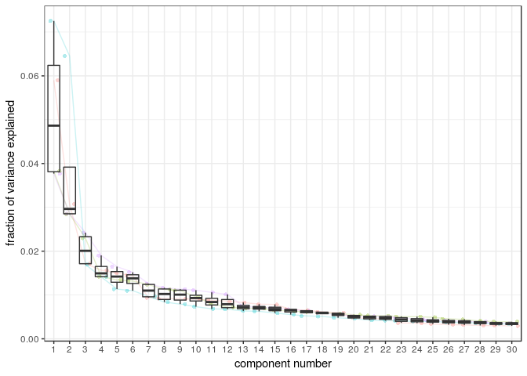 When using 'angular' distance measure (default), it is NOT recommended to reduce the number of components to a bare minimum indicated by the "elbow" inflection point - include 10-20 more (typcally 30 components work well). For 'L2' distance, using fewer components (i.e. at 'elbow' value) is sometimes better. (note: remember that if you want to recalcualte projections, clear the cache for that space, i.e. `con$pairs$PCA <- NULL`).

We next use the graph we identified to get global clusters. Here we use Leiden community detection method to obtain clusters. Increasing the value of the resolution parameter will result in more fine-grained clusters, while decreasing it will return coarser clustering.

``` r
con$findCommunities(method=leiden.community, resolution=1)
```

Visualization
-------------

We can now plot the clusters we obtained. Note that the cluster numbers between different samples now correspond to the same cell type. Also not the presence of cluster 5 in BM samples only, but not in CB.

``` r
con$plotPanel(font.size=4)
```


A convenience function can be used to examine the composition of the clusters in terms of samples, sample entropy (middle), and cluster size (bottom):

``` r
plotClusterBarplots(con, legend.height = 0.1)
```


Check an expression pattern of a specific gene across all the individual embeddings.

``` r
con$plotPanel(gene = 'GZMK')
```


Next we embed and visualize the complete joint graph.

Note: embedding estimation will run the first time around. Please see `$embedGraph()` function for additional embedding options.

Note 2: both functions `$plotGraph` and `$plotPanel` are based on the function `conos::embeddingPlot` and forward all visualization parameters to this function. So, to get full list of the possible parameters see `?conos::embeddingPlot` and examples below.

``` r
con$plotGraph(alpha=0.1)
```

    ## Estimating embeddings.


We note that the graph captures the population structure irrespectively of the sample of origin of each cell.

``` r
con$plotGraph(color.by='sample', mark.groups=F, alpha=0.1, show.legend=T)
```

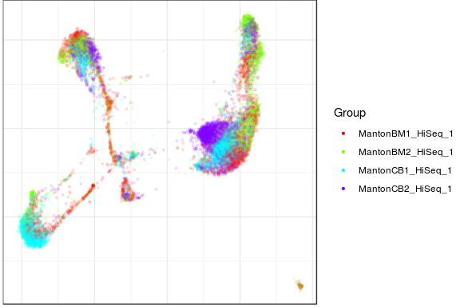

We can also visualize gene expression on this joint graph embedding:

``` r
con$plotGraph(gene='GZMK', title='GZMK expression')
```


Other community detection methods can provide a more sensitive and hierarchical view of the subpopulation structure. Here we run walktrap community detection method on the same joint graph:

``` r
con$findCommunities(method = igraph::walktrap.community, steps=5)
```

Note: it is recommended to use higher number of steps (e.g. 8-10, however these calculations take much longer). Here we'll get a lot of smaller clusters. Note: different clustering results are kept as a simple list under `con$clusters`.

Visualize new clusters:

``` r
con$plotPanel(clustering='walktrap',font.size=4)
```

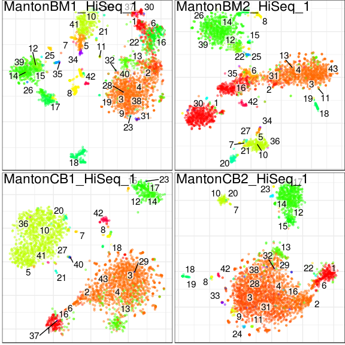

New clustering, as viewed on a joint graph:

``` r
con$plotGraph(clustering='walktrap')
```

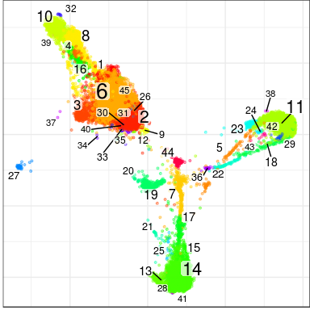

Changing embedding parameters
-----------------------------

At the moment, Conos is able to use two methods of graph embedding: [largeVis](https://github.com/lferry007/LargeVis) (default) and [UMAP](https://github.com/jlmelville/uwot). The UMAP takes a bit longer to estimate, but generally gives better quality of the embedding. Though sometime UMAP makes even slightest difference (which is not detected by either largeVis or even clustering algorithms) looking perfectly distinguishable. It's best to examine both types of embeddings.

### largeVis

For the description of largeVis parameters please look at `conos::projectKNNs` function. The most influential are `alpha` and `sgd_batched`. Decreasing alpha results in less compressed clusters, and increasing sgd\_batches often helps to avoid cluster intersections and spread out the clusters. Here we take alpha to a very low value, for the sake of example:

``` r
con$embedGraph(alpha=0.001, sgd_batched=1e8)
```

    ## Estimating embeddings.

``` r
con$plotGraph(clustering='walktrap', size=0.1)
```

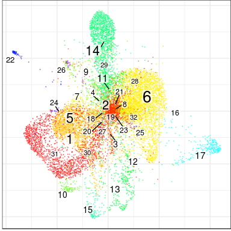

### UMAP

UMAP embedding supports all parameters, described in the [uwot](https://github.com/jlmelville/uwot) package. Two most important ones are `spread` and `min.dist`, which together control how tight the clusters are. According to the [python manual](https://umap-learn.readthedocs.io/en/latest/api.html):

> -   **min.dist:** The effective minimum distance between embedded points. Smaller values will result in a more clustered/clumped embedding where nearby points on the manifold are drawn closer together, while larger values will result on a more even dispersal of points. The value should be set relative to the spread value, which determines the scale at which embedded points will be spread out.
> -   **spread:** The effective scale of embedded points. In combination with min\_dist this determines how clustered/clumped the embedded points are.

``` r
con$embedGraph(method="UMAP", min.dist=0.01, spread=15, n.cores=4)
```

    ## Convert graph to adjacency list...
    ## Done
    ## Estimate nearest neighbors and commute times...
    ## Estimating hitting distances: 12:45:11.
    ## Done.
    ## Estimating commute distances: 12:45:44.
    ## Hashing adjacency list: 12:45:44.
    ## Done.
    ## Estimating distances: 12:45:45.
    ## Done
    ## Done.
    ## All done!: 12:45:48.
    ## Done
    ## Estimate UMAP embedding...

    ## Warning in embedKnnGraph(commute.times, n.neighbors = n.neighbors, names =
    ## adj.info$names, : Maximal number of estimated neighbors is 20

    ## 12:45:48 Read 12000 rows and found 1 numeric columns

    ## 12:45:48 Commencing smooth kNN distance calibration using 4 threads

    ## 12:45:50 Initializing from normalized Laplacian + noise

    ## 12:45:51 Commencing optimization for 1000 epochs, with 238568 positive edges using 4 threads

    ## 12:46:05 Optimization finished

    ## Done

``` r
con$plotGraph(clustering='walktrap', size=0.1)
```

 In the example above, UMAP layout makes even many of the very small subpopulations called by walktrap apparent.

Exploring hierarchical community structure
==========================================

Using code
----------

Walktrap clustering generates a hierarchical community structure.

We can get a cut of the top dendrogram and visualize it. Here we'll cut to get 40 top clusters.

``` r
fc <- greedyModularityCut(con$clusters$walktrap$result,40);
```

The cut determines a finer clustering (likely overclustering) of the dataset on its leafs:

``` r
con$plotGraph(groups=fc$groups, size=0.1)
```

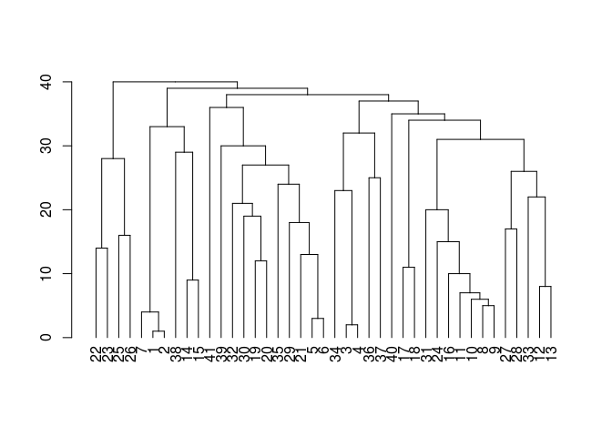

Let's look at the hierarchical structure of these clusters:

``` r
# fc$hc is an hclust structure ... here we will convert it to a dendrogram
dend <- as.dendrogram(fc$hc)
plot(dend)
```

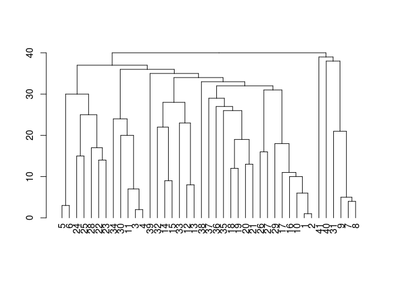

We can modify the dendrogram to show various properties. For instance, alter the width of the edges to reflect how many samples are contributing to it (normalized entropy). To do so, let's first define a factor specifying which samples different samples came from:

``` r
samf <- con$getDatasetPerCell()
str(samf)
```

    ##  Factor w/ 4 levels "MantonBM1_HiSeq_1",..: 1 1 1 1 1 1 1 1 1 1 ...
    ##  - attr(*, "names")= chr [1:12000] "MantonBM1_HiSeq_1-TCTATTGGTCTCTCGT-1" "MantonBM1_HiSeq_1-GAATAAGTCACGCATA-1" "MantonBM1_HiSeq_1-ACACCGGTCTAACTTC-1" "MantonBM1_HiSeq_1-TCATTTGGTACGCTGC-1" ...

Now we'll use `dendSetWidthByBreadth()` function to calculate the entropies of each edge and set the width accordingly:

``` r
dend <- dendSetWidthByBreadth(dend,samf,fc$leafContent, min.width=1, max.width=4)
plot(dend)
```

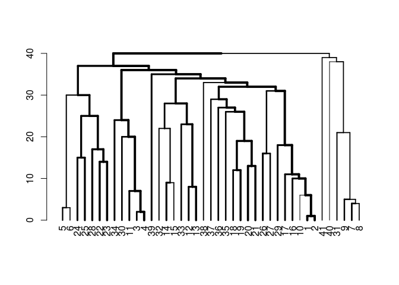

Similarly, we can find a factor that labels cells by the tissue they are from (in this case BM or CB). To define the factor for this simple dataset, we'll simply parse the cell names:

``` r
tissue.factor <- as.factor(setNames(ifelse(grepl('BM',names(samf)),'BM','CB'), names(samf)))
str(tissue.factor)
```

    ##  Factor w/ 2 levels "BM","CB": 1 1 1 1 1 1 1 1 1 1 ...
    ##  - attr(*, "names")= chr [1:12000] "MantonBM1_HiSeq_1-TCTATTGGTCTCTCGT-1" "MantonBM1_HiSeq_1-GAATAAGTCACGCATA-1" "MantonBM1_HiSeq_1-ACACCGGTCTAACTTC-1" "MantonBM1_HiSeq_1-TCATTTGGTACGCTGC-1" ...

Now, let's color the edges according to the tissue mixture:

``` r
dend <- dendSetColorByMixture(dend, tissue.factor, fc$leafContent)
plot(dend)
```

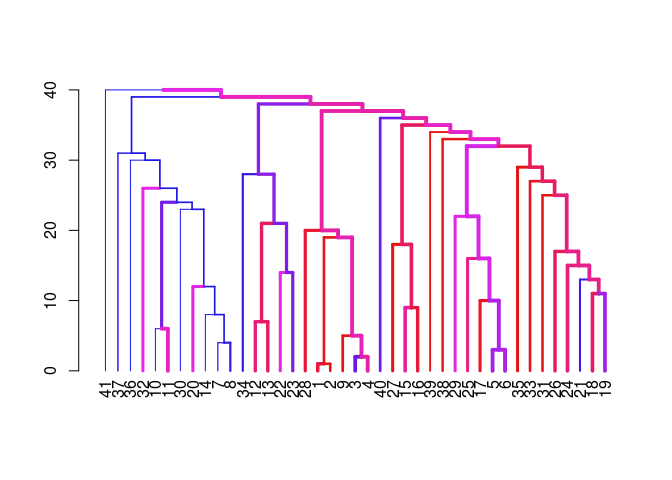

Using Shiny Application
-----------------------

An alternative way to explore this the hierarchical community structure using an interactive app. The app also allows to visualize tissue composition and sample similarities:

``` r
conosShinyApp(con,N=30)
```

Label propagation
=================

General workflow
----------------

One of the uses of this graph is to propagate labels. For example in some cases we will only have information about the cell types in one of the samples and we want to automatically label the other samples.

We'll load annotation from a simple text file (first column giving cell name, second - cell type), and make a named factor out of it:

``` r
cellannot <- read.table(file.path(find.package('conos'),'extdata','cellannot.txt'),header=F)
cellannot <- setNames(cellannot[,2], cellannot[,1])
```

Next we plot our panel with the annotations we made. This is to verify that the annotated cells are indeed in only one sample and that the other samples are unlabelled.

``` r
con$plotPanel(groups = cellannot)
```

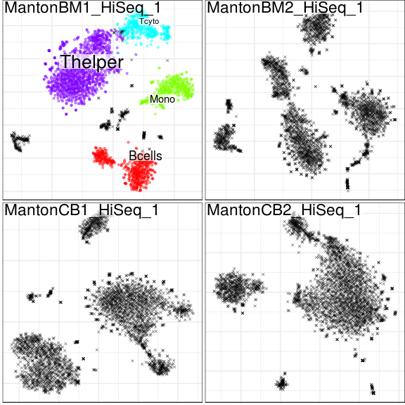

Next let's propagates the labels from the one annotated sample to the other samples.

``` r
new.label.probabilities <- con$propagateLabels(labels = cellannot, verbose=T)
```

This function returns probabilities of each cell belonging to each group. These probabilities can be used to estimate uncertainty of the labeling:

``` r
con$plotGraph(colors=(1 - apply(new.label.probabilities, 1, max)), show.legend=T, legend.title="Uncertainty", legend.pos=c(1, 0))
```

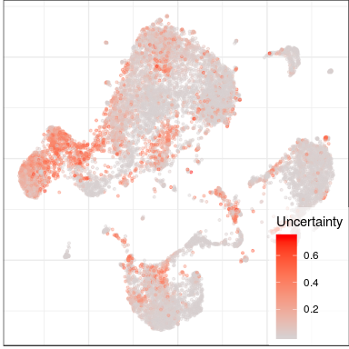

Now we can assign each cell to the the the cell type with the highest probability. Though we can see that one cluster has high uncertainty and possibly represent a cell type, not presented in the initial annotation.

``` r
new.annot <- setNames(colnames(new.label.probabilities)[apply(new.label.probabilities,1,which.max)], rownames(new.label.probabilities))
head(new.annot)
```

    ## MantonBM1_HiSeq_1-ACTTGTTCATTGGTAC-1 MantonBM2_HiSeq_1-TTTGCGCGTAGCGCTC-1 
    ##                               "Mono"                               "Mono" 
    ## MantonBM1_HiSeq_1-TGCTACCCACACGCTG-1 MantonBM2_HiSeq_1-GGGAATGCATCGGAAG-1 
    ##                               "Mono"                               "Mono" 
    ## MantonBM2_HiSeq_1-GGTGAAGCACGTAAGG-1 MantonBM1_HiSeq_1-AGCCTAAGTCTCCCTA-1 
    ##                               "Mono"                               "Mono"

We now see that all our samples have been labelled automatically!

``` r
con$plotPanel(groups = new.annot)
```

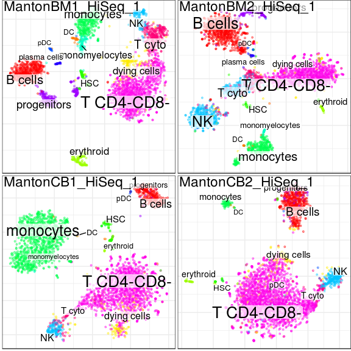

The same effect can be achieved with parameter `return.distribution=F` (though it's recommended to always examine uncertainty):

``` r
new.annot2 <- con$propagateLabels(labels = cellannot, verbose=F, return.distribution=F)
all(new.annot2 == new.annot)
```

    ## [1] TRUE

By default, label propagation affects initial labels as well:

``` r
sum(new.annot[names(cellannot)] != cellannot)
```

    ## [1] 5

Even though here the effect on this data is not that pronounced, sometimes we trust initial labeling completely and don't want to change it. In this case, option `fixed.initial.labels=T` should be used:

``` r
new.annot <- con$propagateLabels(labels = cellannot, verbose=F, return.distribution=F, fixed.initial.labels=T)
all(new.annot[names(cellannot)] == cellannot)
```

    ## [1] TRUE

``` r
con$plotPanel(groups = new.annot)
```

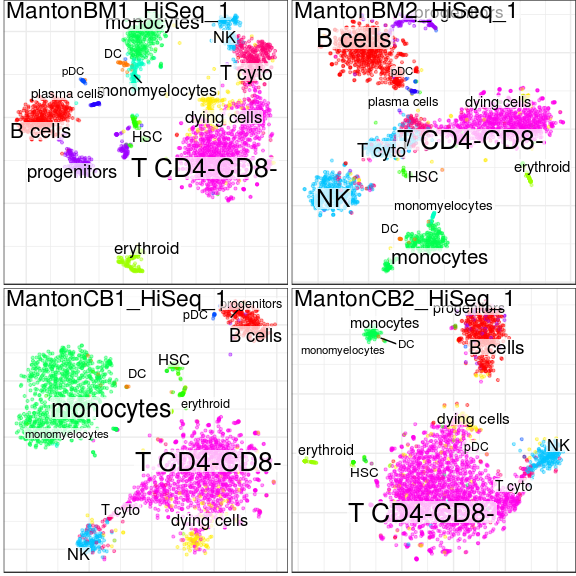

Differential expression
=======================

Cluster markers
---------------

The first step we can do to understand meaning of the dataset is to look at the cluster cell markers:

``` r
de.info <- con$getDifferentialGenes(groups=new.annot)
```

    ## Estimating marker genes per sample
    ## Aggregating marker genes
    ## All done!

``` r
head(de.info$Bcells)
```

    ##       Gene        Z        PValue          PAdj
    ## 1     CD74 34.63345 1.373927e-261 2.958339e-257
    ## 2  HLA-DRA 32.99534 1.564337e-237 3.368173e-233
    ## 3    CD79A 30.64942 4.127488e-205 8.886483e-201
    ## 4 HLA-DPB1 29.63458 7.950516e-192 1.711667e-187
    ## 5 HLA-DPA1 29.34125 4.538829e-188 9.771191e-184
    ## 6     IGHM 28.30342 4.444694e-175 9.568094e-171

``` r
cowplot::plot_grid(con$plotGraph(groups=new.annot), con$plotGraph(gene="CD74"))
```

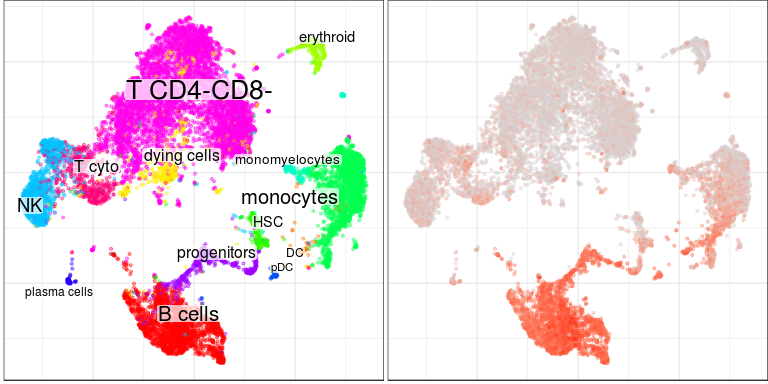

DE Between Sample Groups
------------------------

Next, given a joint clustering of cells that captures cell relationships between samples, we can want to ask what is different between the cells of these populations between specific samples types, in this case CB and BM samples. Conos provides routines to be able to do that.

First we need to define our sample groups

``` r
samplegroups <- list(
  bm = c("MantonBM1_HiSeq_1","MantonBM2_HiSeq_1"),
  cb = c("MantonCB1_HiSeq_1","MantonCB2_HiSeq_1")
)
```

### Simple run

We can then run differential expression between cells in these groups

``` r
de.info <- getPerCellTypeDE(con, groups=as.factor(new.annot), sample.groups = samplegroups, ref.level='bm', n.cores=4)
```

...and examine the output

``` r
str(de.info[1:3], 2)
```

    ## List of 3
    ##  $ Bcells:List of 3
    ##   ..$ res          :'data.frame':    15032 obs. of  6 variables:
    ##   ..$ cm           :Formal class 'dgCMatrix' [package "Matrix"] with 6 slots
    ##   ..$ sample.groups:List of 2
    ##  $ Mono  :List of 3
    ##   ..$ res          :'data.frame':    15032 obs. of  6 variables:
    ##   ..$ cm           :Formal class 'dgCMatrix' [package "Matrix"] with 6 slots
    ##   ..$ sample.groups:List of 2
    ##  $ Tcyto :List of 3
    ##   ..$ res          :'data.frame':    15032 obs. of  6 variables:
    ##   ..$ cm           :Formal class 'dgCMatrix' [package "Matrix"] with 6 slots
    ##   ..$ sample.groups:List of 2

Let's look at the results for the B cells

``` r
res <- de.info[['Bcells']]$res
head(res[order(res$padj,decreasing = FALSE),])
```

    ##                baseMean log2FoldChange     lfcSE       stat       pvalue
    ## JCHAIN         874.5702      -5.148581 0.4449532 -11.571061 5.776397e-31
    ## IGHA1         2259.1546     -12.729020 1.4286556  -8.909789 5.112969e-19
    ## IGKC          9791.7293      -4.465739 0.5116172  -8.728673 2.576784e-18
    ## IGHG1          763.8405     -12.581034 1.5077365  -8.344319 7.162542e-17
    ## RP11-386I14.4  450.5186       2.643571 0.4109049   6.433534 1.246706e-10
    ## CD69           597.5938       2.528123 0.4198532   6.021447 1.728649e-09
    ##                       padj
    ## JCHAIN        8.578527e-27
    ## IGHA1         3.796635e-15
    ## IGKC          1.275594e-14
    ## IGHG1         2.659273e-13
    ## RP11-386I14.4 3.702967e-07
    ## CD69          4.278695e-06

### With correction

In certain cases we observe that differential expression will result in the similar genes between multiple cell types. This may be due to genuine biological reasons (similar response), due to background, or due to other effects. Conos can calculate a mean expression vector between the two conditions and subtract this from all the comparisons, so observer the cell-type specific effect.

``` r
fc.correction <- getCorrectionVector(con, groups=as.factor(new.annot),sample.groups = samplegroups, ref.level='bm', n.cores=4,correction.method='varianceweighted')
fc.correction[is.na(fc.correction)] <- 0

## Use corrected version
de.info.corrected <- getPerCellTypeDECorrected(con, groups=as.factor(new.annot),sample.groups = samplegroups, ref.level='bm', n.cores=4, correction = fc.correction)
```

``` r
res <- as.data.frame(de.info.corrected[['Bcells']]$res)
head(res[order(res$padj,decreasing = FALSE),])
```

    ##                 baseMean log2FoldChange     lfcSE       stat    pvalue
    ## FO538757.2    48.0155436     -0.2987226 0.6345094 -0.4707931 0.6377885
    ## AP006222.2     8.4205941      0.3449928 1.1319515  0.3047770 0.7605360
    ## RP4-669L17.10  0.9451299      2.1406968 3.2412987  0.6604442 0.5089688
    ## RP11-206L10.9 14.3768751     -0.3186551 0.9272098 -0.3436710 0.7310938
    ## LINC00115      7.9226649     -0.3689033 1.1397225 -0.3236781 0.7461817
    ## FAM41C         9.2414880      0.2356306 1.1463574  0.2055472 0.8371446
    ##                    padj
    ## FO538757.2    0.9999972
    ## AP006222.2    0.9999972
    ## RP4-669L17.10 0.9999972
    ## RP11-206L10.9 0.9999972
    ## LINC00115     0.9999972
    ## FAM41C        0.9999972
