Conos Walkthrough
================

In this tutorial we will go over the analysis of a panel of samples
using Conos. Conos objects can be used to identify clusters of
corresponding cells across panels of samples from similar or dissimilar
sources, with different degrees of cell type overlap. Here we will
identify corresponding clusters across a panel of bone marrow (BM) and
cord blood (CB) by generating a joint graph with the cells from all the
samples. We will use the graph to propagate labels from a single
labelled sample to other samples and finally perform differential
expression between BM and CB samples.

First, let’s load Conos library to start with:

``` r
library(conos)
library(dplyr)
```

# Loading the data

Next we will load a previously prepared panel of samples. This panel was
made up of 16 cord blood and bone marrow samples, but here we look at a
smaller subset of just 4 samples. All samples have been subset to
exactly 3000 cells. Note: when starting with your own panel, it’s
recommended to filter out low-count / poor /dying cells.

``` r
panel <- readRDS(file.path(find.package('conos'),'extdata','panel.rds'))
```

Let’s take a look at the panel. The panel is a named list of sparse
matrices (type dgCMatrix).

``` r
str(panel,1)
```

    ## List of 4
    ##  $ MantonBM1_HiSeq_1:Formal class 'dgCMatrix' [package "Matrix"] with 6 slots
    ##  $ MantonBM2_HiSeq_1:Formal class 'dgCMatrix' [package "Matrix"] with 6 slots
    ##  $ MantonCB1_HiSeq_1:Formal class 'dgCMatrix' [package "Matrix"] with 6 slots
    ##  $ MantonCB2_HiSeq_1:Formal class 'dgCMatrix' [package "Matrix"] with 6 slots

Before we continue it is very important to make sure that cells in our
panel are uniquely named. No two cells (even in different samples)
should be named identically. In this case the cells have been prefixed
by sample id, so there will not be any collisions. However in most cases
you will have to prefix the cells before continuing.

``` r
head(colnames(panel[[1]]))
```

    ## [1] "MantonBM1_HiSeq_1-TCTATTGGTCTCTCGT-1"
    ## [2] "MantonBM1_HiSeq_1-GAATAAGTCACGCATA-1"
    ## [3] "MantonBM1_HiSeq_1-ACACCGGTCTAACTTC-1"
    ## [4] "MantonBM1_HiSeq_1-TCATTTGGTACGCTGC-1"
    ## [5] "MantonBM1_HiSeq_1-TATTACCCAAAGGAAG-1"
    ## [6] "MantonBM1_HiSeq_1-CGCCAAGCATCTGGTA-1"

To quickly check that the cell names will be unique, we can run:

``` r
any(duplicated(unlist(lapply(panel,colnames))))
```

    ## [1] FALSE

Conos is focused on integration, and relies on
[pagoda2](https://github.com/hms-dbmi/pagoda2) or
[Seurat](https://satijalab.org/seurat/) to perform dataset
pre-processing.

## Pre-processing with Pagoda2

We will generate pagoda2 apps for poorly-expressed genes from each
individual sample using `basicP2proc` helper function for quick
processing. As the datasets will be compared to each other we will turn
off automated dropping of low-expressed genes (`min.cells.per.gene=0`),
and lower the numbers of local PCs estimated for faster processing.
(note: you could run the outer loop in parallel using mclapply, however
if ran within RStudio this sometimes causes multi-threading problems;
also, multiprocessing must be disabled in order to obtain exactly the
same individual sample embeddings from one run to another: this can be
done by using `set.seed(1)` and specifying `n.cores=1` in the command
below).

``` r
library(pagoda2)
panel.preprocessed <- lapply(panel, basicP2proc, n.cores=4, min.cells.per.gene=0, n.odgenes=2e3, get.largevis=FALSE, make.geneknn=FALSE)
```

    ## 3000 cells, 33694 genes; normalizing ... using plain model winsorizing ... log scale ... done.
    ## calculating variance fit ... using gam 171 overdispersed genes ... 171persisting ... done.
    ## running PCA using 2000 OD genes .... done
    ## running tSNE using 4 cores:
    ## 3000 cells, 33694 genes; normalizing ... using plain model winsorizing ... log scale ... done.
    ## calculating variance fit ... using gam 159 overdispersed genes ... 159persisting ... done.
    ## running PCA using 2000 OD genes .... done
    ## running tSNE using 4 cores:
    ## 3000 cells, 33694 genes; normalizing ... using plain model winsorizing ... log scale ... done.
    ## calculating variance fit ... using gam 248 overdispersed genes ... 248persisting ... done.
    ## running PCA using 2000 OD genes .... done
    ## running tSNE using 4 cores:
    ## 3000 cells, 33694 genes; normalizing ... using plain model winsorizing ... log scale ... done.
    ## calculating variance fit ... using gam 166 overdispersed genes ... 166persisting ... done.
    ## running PCA using 2000 OD genes .... done
    ## running tSNE using 4 cores:

Let’s look at the output of our processing. We now have a named list of
pagoda2 objects, which is the starting point for the analysis with
Conos.

``` r
str(panel.preprocessed,1)
```

    ## List of 4
    ##  $ MantonBM1_HiSeq_1:Reference class 'Pagoda2' [package "pagoda2"] with 16 fields
    ##   ..and 34 methods, of which 20 are  possibly relevant
    ##  $ MantonBM2_HiSeq_1:Reference class 'Pagoda2' [package "pagoda2"] with 16 fields
    ##   ..and 34 methods, of which 20 are  possibly relevant
    ##  $ MantonCB1_HiSeq_1:Reference class 'Pagoda2' [package "pagoda2"] with 16 fields
    ##   ..and 34 methods, of which 20 are  possibly relevant
    ##  $ MantonCB2_HiSeq_1:Reference class 'Pagoda2' [package "pagoda2"] with 16 fields
    ##   ..and 34 methods, of which 20 are  possibly relevant

## Pre-processing with Seurat

The alternative, Seurat, pre-processing can be done in a similar way
using an analogous `basicSeuratProc` helper function. Alternatively, if
you already have a set of Seurat objects (one per dataset), you can just
skip this step and feed them directly to `Conos$new()` as shown below.

``` r
library(Seurat)
panel.preprocessed <- lapply(panel, basicSeuratProc)
```

We note that sample pre-processing steps can be used to filter/adjust
the data in custom ways. For instance, one can reduce the impact of the
cell cycle contribution by omitting cycle-annotated genes from the
matrices prior to the pre-processing. Similarly, if it is deemed
appropriate, one can regress out certain signatures using [standard
techniques](https://satijalab.org/seurat/v3.0/cell_cycle_vignette.html#regress-out-cell-cycle-scores-during-data-scaling).

# Integrating datasets with Conos

We will now construct a Conos object for this panel of samples. At this
point we haven’t calculated anything. We have just generated an object
that contains the samples. Note that at this step we also set the
n.cores parameter. The graph generation with Conos can take advantage of
parallel processing, so use as many physical cores as you have available
here.

``` r
con <- Conos$new(panel.preprocessed, n.cores=4)
```

Our original pagoda2 (or Seurat) objects are now saved in the Conos
object (if you are short of memory you can go ahead and delete the
originals).

``` r
str(con$samples,1)
```

    ## List of 4
    ##  $ MantonBM1_HiSeq_1:Reference class 'Pagoda2' [package "pagoda2"] with 16 fields
    ##   ..and 34 methods, of which 20 are  possibly relevant
    ##  $ MantonBM2_HiSeq_1:Reference class 'Pagoda2' [package "pagoda2"] with 16 fields
    ##   ..and 34 methods, of which 20 are  possibly relevant
    ##  $ MantonCB1_HiSeq_1:Reference class 'Pagoda2' [package "pagoda2"] with 16 fields
    ##   ..and 34 methods, of which 20 are  possibly relevant
    ##  $ MantonCB2_HiSeq_1:Reference class 'Pagoda2' [package "pagoda2"] with 16 fields
    ##   ..and 34 methods, of which 20 are  possibly relevant

We can now plot a panel of these samples using the clusters we
identified by examining each sample on its own. We note that each sample
has an independent set of clusters that bears no relationship to
clusters in other sample (for example note cluster
9).

``` r
con$plotPanel(clustering="multilevel", use.local.clusters=T, title.size=6)
```

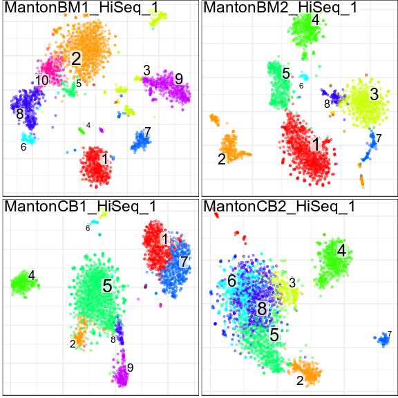<!-- -->

Next we will build the joint graph that encompasses all the samples. We
do that by pairwise projecting samples onto a common space and
establishing kNN of mNN pairs between the samples. We then append
within-sample kNN neighbours to the graph to ensure that all the cell
are included in the graph.

  - We use ‘PCA’ space here which is very fast and will yield good
    integration in most cases.
  - CPCA space should provide more accurate alignment under greater
    dataset-specific distortions.
  - CCA space optimizes conservation of correlation between datasets and
    can give yield very good alignments in low-similarity cases
    (e.g. large evolutionary distances).
  - If your datasets were all measured on the same platform you may also
    want to consider “genes” space which can give better resolution in
    such (simpler) cases.

Other parameters passed to the `buildGraph()` function below are all
default values - so are shown just for
information.

``` r
con$buildGraph(k=30, k.self=5, space='PCA', ncomps=30, n.odgenes=2000, matching.method='mNN', metric='angular', score.component.variance=TRUE, verbose=TRUE)
```

    ## found 0 out of 6 cached PCA  space pairs ... running 6 additional PCA  space pairs  done
    ## inter-sample links using  mNN   done
    ## local pairs local pairs  done
    ## building graph ..done

Note: as pairwise comparisons may take a while, Conos will cache results
for each space. If you want to recalculate, for instance PCA, pairings
with different set of parameters (e.g. more components, different number
of starting over-dispersed genes), clear the cache first by doing
`con$pairs$PCA <- NULL`.

In the `$buildGraph()` invokation above, we specified
`score.component.variance=TRUE` which estimates amount of variance
explained by successive PCs (by default this option is off to save
time). We can visualize the results using:

``` r
plotComponentVariance(con, space='PCA')
```

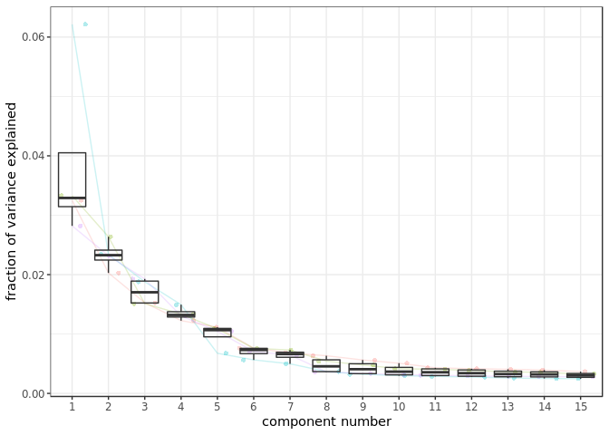<!-- --> When
using ‘angular’ distance measure (default), it is NOT recommended to
reduce the number of components to a bare minimum indicated by the
“elbow” inflection point - include 10-20 more (typcally 30 components
work well). For ‘L2’ distance, using fewer components (i.e. at ‘elbow’
value) is sometimes better. (note: remember that if you want to
recalcualte projections, clear the cache for that space, i.e.
`con$pairs$PCA <- NULL`).

We next use the graph we identified to get global clusters. Here we use
Leiden community detection method to obtain clusters. Increasing the
value of the resolution parameter will result in more fine-grained
clusters, while decreasing it will return coarser clustering.

``` r
con$findCommunities(method=leiden.community, resolution=1)
```

## Visualization

We can now plot the clusters we obtained. Note that the cluster numbers
between different samples now correspond to the same cell type. Also not
the presence of cluster 5 in BM samples only, but not in CB.

``` r
con$plotPanel(font.size=4)
```

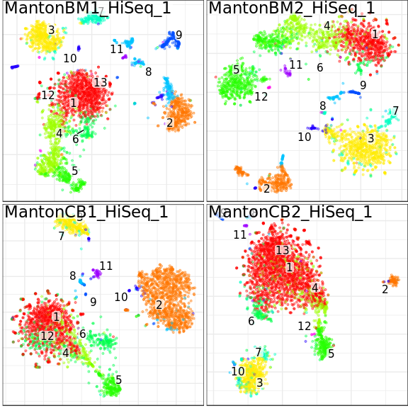<!-- -->

A convenience function can be used to examine the composition of the
clusters in terms of samples, sample entropy (middle), and cluster size
(bottom):

``` r
plotClusterBarplots(con, legend.height = 0.1)
```

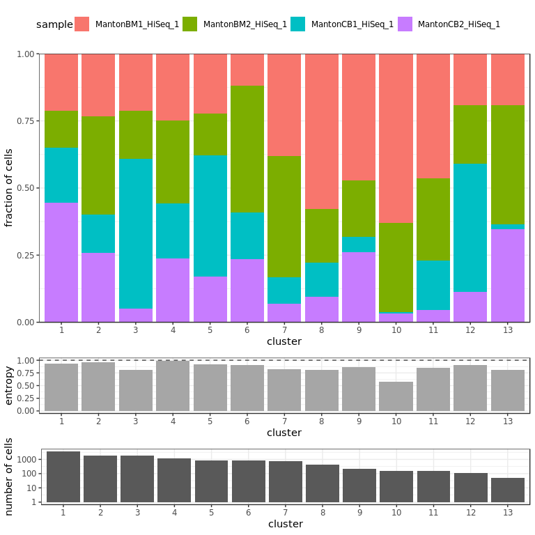<!-- -->

Check an expression pattern of a specific gene across all the individual
embeddings.

``` r
con$plotPanel(gene = 'GZMK')
```

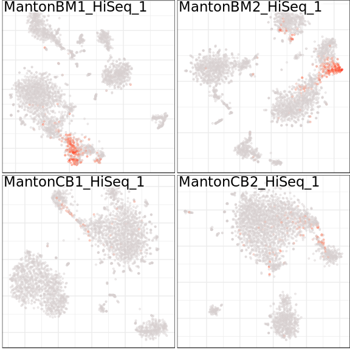<!-- -->

Next we embed and visualize the complete joint graph.

Note: embedding estimation will run the first time around. Please see
`$embedGraph()` function for additional embedding options.

Note 2: both functions `$plotGraph` and `$plotPanel` are based on the
function `conos::embeddingPlot` and forward all visualization parameters
to this function. So, to get full list of the possible parameters see
`?conos::embeddingPlot` and examples below.

``` r
con$plotGraph(alpha=0.1)
```

    ## Estimating embeddings.

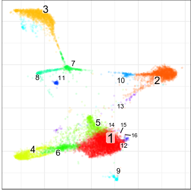<!-- -->

We note that the graph captures the population structure irrespectively
of the sample of origin of each
cell.

``` r
con$plotGraph(color.by='sample', mark.groups=F, alpha=0.1, show.legend=T)
```

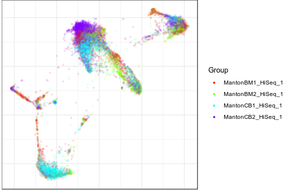<!-- -->

We can also visualize gene expression on this joint graph embedding:

``` r
con$plotGraph(gene='GZMK', title='GZMK expression')
```

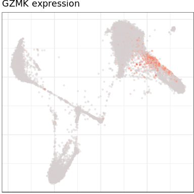<!-- -->

Other community detection methods can provide a more sensitive and
hierarchical view of the subpopulation structure. Here we run walktrap
community detection method on the same joint graph:

``` r
con$findCommunities(method = igraph::walktrap.community, steps=7)
```

Note: it is recommended to use higher number of steps (e.g. 8-10,
however these calculations take much longer). Here we’ll get a lot of
smaller clusters. Note: different clustering results are kept as a
simple list under `con$clusters`.

Visualize new clusters:

``` r
con$plotPanel(clustering='walktrap',font.size=4)
```

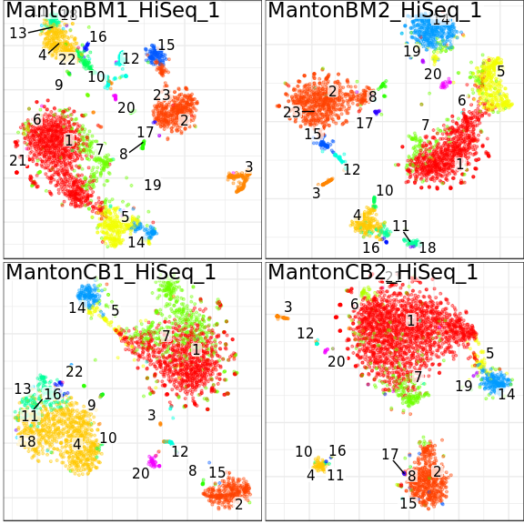<!-- -->

New clustering, as viewed on a joint graph:

``` r
con$plotGraph(clustering='walktrap')
```

<!-- -->

## Changing embedding parameters

At the moment, Conos is able to use two methods of graph embedding:
[largeVis](https://github.com/lferry007/LargeVis) (default) and
[UMAP](https://github.com/jlmelville/uwot). The UMAP takes a bit longer
to estimate, but generally gives better quality of the embedding. Though
sometime UMAP makes even slightest difference (which is not detected by
either largeVis or even clustering algorithms) looking perfectly
distinguishable. It’s best to examine both types of embeddings.

### largeVis

For the description of largeVis parameters please look at
`conos::projectKNNs` function. The most influential are `alpha` and
`sgd_batched`. Decreasing alpha results in less compressed clusters, and
increasing sgd\_batches often helps to avoid cluster intersections and
spread out the clusters. Here we take alpha to a very low value, for the
sake of example:

``` r
con$embedGraph(alpha=0.001, sgd_batched=1e8)
```

    ## Estimating embeddings.

``` r
con$plotGraph(clustering='walktrap', size=0.1)
```

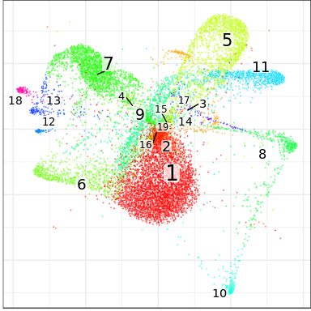<!-- -->

### UMAP

UMAP embedding supports all parameters, described in the
[uwot](https://github.com/jlmelville/uwot) package. Two most important
ones are `spread` and `min.dist`, which together control how tight the
clusters are. According to the [python
manual](https://umap-learn.readthedocs.io/en/latest/api.html):

>   - **min.dist:** The effective minimum distance between embedded
>     points. Smaller values will result in a more clustered/clumped
>     embedding where nearby points on the manifold are drawn closer
>     together, while larger values will result on a more even dispersal
>     of points. The value should be set relative to the spread value,
>     which determines the scale at which embedded points will be spread
>     out.
>   - **spread:** The effective scale of embedded points. In combination
>     with min\_dist this determines how clustered/clumped the embedded
>     points are.

There is also a parametr, responsible for trade-off between performance
and accuracy: \> - **min.prob.lower:** minimal probability of hitting a
neighbor, after which the random walk stops. Default:
1e-7.

``` r
con$embedGraph(method="UMAP", min.dist=0.01, spread=15, n.cores=4, min.prob.lower=1e-3)
```

    ## Convert graph to adjacency list...
    ## Done
    ## Estimate nearest neighbors and commute times...
    ## Estimating hitting distances: 19:04:52.
    ## Done.
    ## Estimating commute distances: 19:04:55.
    ## Hashing adjacency list: 19:04:55.
    ## Done.
    ## Estimating distances: 19:04:56.
    ## Done
    ## Done.
    ## All done!: 19:04:58.
    ## Done
    ## Estimate UMAP embedding...

    ## 19:04:58 Read 12000 rows and found 1 numeric columns

    ## 19:04:58 Commencing smooth kNN distance calibration using 4 threads

    ## 19:04:59 Initializing from normalized Laplacian + noise

    ## 19:05:00 Commencing optimization for 1000 epochs, with 349862 positive edges using 4 threads

    ## 19:05:16 Optimization finished

    ## Done

``` r
con$plotGraph(clustering='walktrap', size=0.1)
```

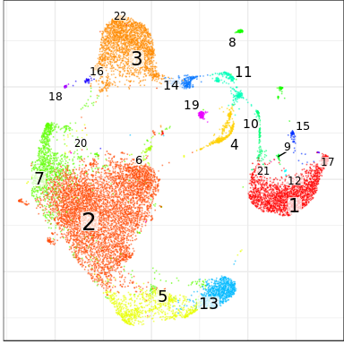<!-- -->

In the example above, UMAP layout makes even many of the very small
subpopulations called by walktrap apparent.

### plotPanel with common embedding

Now we can use this common embedding in `plotPanel` as well:

``` r
con$plotPanel(clustering='walktrap', size=0.1, use.common.embedding=T)
```

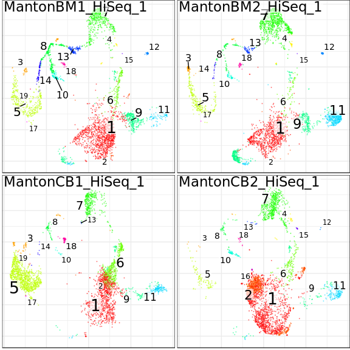<!-- -->

# Exploring hierarchical community structure

## Using code

Walktrap clustering generates a hierarchical community structure.

We can get a cut of the top dendrogram and visualize it. Here we’ll cut
to get 40 top clusters.

``` r
fc <- greedyModularityCut(con$clusters$walktrap$result,40);
```

The cut determines a finer clustering (likely overclustering) of the
dataset on its leafs:

``` r
con$plotGraph(groups=fc$groups, size=0.1)
```

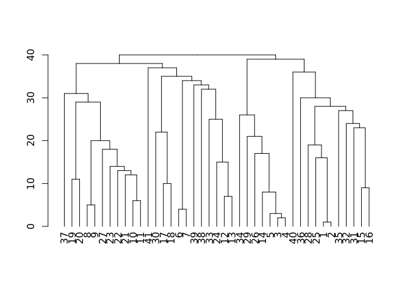<!-- -->

Let’s look at the hierarchical structure of these
clusters:

``` r
# fc$hc is an hclust structure ... here we will convert it to a dendrogram
dend <- as.dendrogram(fc$hc)
plot(dend)
```

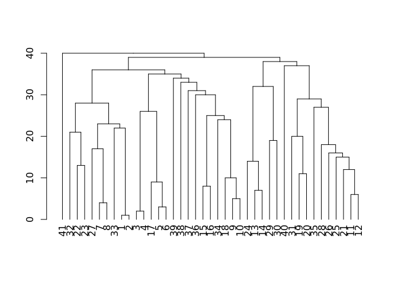<!-- -->

We can modify the dendrogram to show various properties. For instance,
alter the width of the edges to reflect how many samples are
contributing to it (normalized entropy). To do so, let’s first define a
factor specifying which samples different samples came from:

``` r
samf <- con$getDatasetPerCell()
str(samf)
```

    ##  Factor w/ 4 levels "MantonBM1_HiSeq_1",..: 1 1 1 1 1 1 1 1 1 1 ...
    ##  - attr(*, "names")= chr [1:12000] "MantonBM1_HiSeq_1-TCTATTGGTCTCTCGT-1" "MantonBM1_HiSeq_1-GAATAAGTCACGCATA-1" "MantonBM1_HiSeq_1-ACACCGGTCTAACTTC-1" "MantonBM1_HiSeq_1-TCATTTGGTACGCTGC-1" ...

Now we’ll use `dendSetWidthByBreadth()` function to calculate the
entropies of each edge and set the width
accordingly:

``` r
dend <- dendSetWidthByBreadth(dend,samf,fc$leafContent, min.width=1, max.width=4)
plot(dend)
```

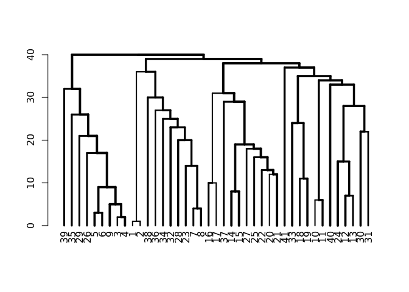<!-- -->

Similarly, we can find a factor that labels cells by the tissue they are
from (in this case BM or CB). To define the factor for this simple
dataset, we’ll simply parse the cell
names:

``` r
tissue.factor <- as.factor(setNames(ifelse(grepl('BM',names(samf)),'BM','CB'), names(samf)))
str(tissue.factor)
```

    ##  Factor w/ 2 levels "BM","CB": 1 1 1 1 1 1 1 1 1 1 ...
    ##  - attr(*, "names")= chr [1:12000] "MantonBM1_HiSeq_1-TCTATTGGTCTCTCGT-1" "MantonBM1_HiSeq_1-GAATAAGTCACGCATA-1" "MantonBM1_HiSeq_1-ACACCGGTCTAACTTC-1" "MantonBM1_HiSeq_1-TCATTTGGTACGCTGC-1" ...

Now, let’s color the edges according to the tissue mixture:

``` r
dend <- dendSetColorByMixture(dend, tissue.factor, fc$leafContent)
plot(dend)
```

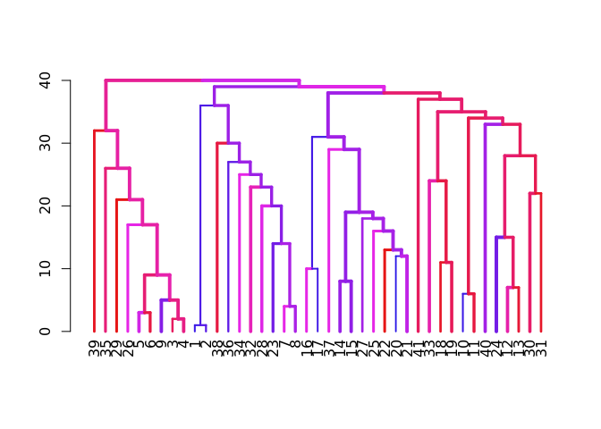<!-- -->

## Using Shiny Application

An alternative way to explore this the hierarchical community structure
using an interactive app. The app also allows to visualize tissue
composition and sample similarities:

``` r
conosShinyApp(con,N=30)
```

# Label propagation

One of the uses of this graph is to propagate labels. For example in
some cases we will only have information about the cell types in one of
the samples and we want to automatically label the other samples.

We’ll load annotation from a simple text file (first column giving cell
name, second - cell type), and make a named factor out of
it:

``` r
cellannot <- read.table(file.path(find.package('conos'),'extdata','cellannot.txt'),header=F,sep='\t')
cellannot <- setNames(cellannot[,2], cellannot[,1])
```

Next we plot our panel with the annotations we made. This is to verify
that the annotated cells are indeed in only one sample and that the
other samples are unlabelled.

``` r
con$plotPanel(groups = cellannot)
```

    ## Warning: Factor `Group` contains implicit NA, consider using
    ## `forcats::fct_explicit_na`
    
    ## Warning: Factor `Group` contains implicit NA, consider using
    ## `forcats::fct_explicit_na`
    
    ## Warning: Factor `Group` contains implicit NA, consider using
    ## `forcats::fct_explicit_na`
    
    ## Warning: Factor `Group` contains implicit NA, consider using
    ## `forcats::fct_explicit_na`
    
    ## Warning: Factor `Group` contains implicit NA, consider using
    ## `forcats::fct_explicit_na`
    
    ## Warning: Factor `Group` contains implicit NA, consider using
    ## `forcats::fct_explicit_na`

    ## Warning: Removed 1 rows containing missing values (geom_label_repel).
    
    ## Warning: Removed 1 rows containing missing values (geom_label_repel).
    
    ## Warning: Removed 1 rows containing missing values (geom_label_repel).

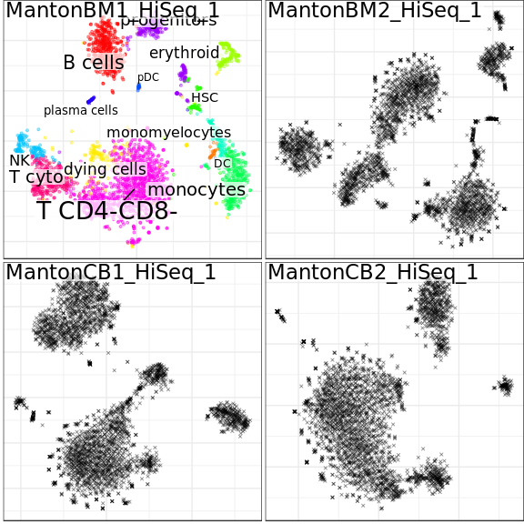<!-- -->

Next let’s propagates the labels from the one annotated sample to the
other samples.

``` r
new.label.info <- con$propagateLabels(labels = cellannot, verbose=T)
```

This function returns probabilities, uncertainty scores and final labels
in the dataset of each cell belonging to each
group:

``` r
con$plotPanel(colors=new.label.info$uncertainty, show.legend=T, legend.title="Uncertainty", legend.pos=c(1, 0))
```

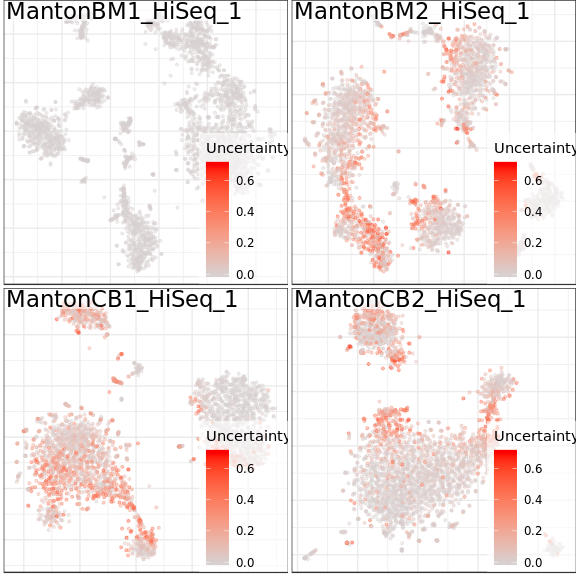<!-- -->

``` r
con$plotPanel(groups=new.label.info$labels, show.legend=F)
```

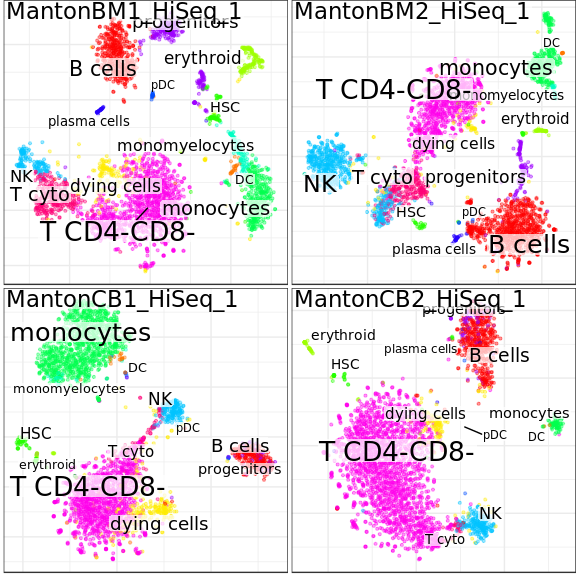<!-- -->

``` r
head(new.label.info$label.distribution)
```

    ##                                        T CD4-CD8-  progenitors
    ## MantonBM1_HiSeq_1-CGATTGACACCTCGGA-1 0.000000e+00 0.000000e+00
    ## MantonBM2_HiSeq_1-CTGATAGAGCGTTCCG-1 2.535885e-05 6.687189e-08
    ## MantonBM1_HiSeq_1-AGGTCCGTCTCTGCTG-1 0.000000e+00 0.000000e+00
    ## MantonBM2_HiSeq_1-GGAAAGCCAGACGCCT-1 3.708576e-06 4.243413e-08
    ## MantonBM2_HiSeq_1-GGGTTGCGTAGCTGCC-1 2.445825e-06 1.553065e-09
    ## MantonBM2_HiSeq_1-GACAGAGGTCACAAGG-1 3.687123e-02 7.782137e-07
    ##                                           B cells        NK       T cyto
    ## MantonBM1_HiSeq_1-CGATTGACACCTCGGA-1 0.000000e+00 1.0000000 0.000000e+00
    ## MantonBM2_HiSeq_1-CTGATAGAGCGTTCCG-1 5.805073e-10 0.9998261 1.479521e-04
    ## MantonBM1_HiSeq_1-AGGTCCGTCTCTGCTG-1 0.000000e+00 1.0000000 0.000000e+00
    ## MantonBM2_HiSeq_1-GGAAAGCCAGACGCCT-1 2.855374e-10 0.9999793 1.685568e-05
    ## MantonBM2_HiSeq_1-GGGTTGCGTAGCTGCC-1 4.165759e-10 0.9999579 3.957049e-05
    ## MantonBM2_HiSeq_1-GACAGAGGTCACAAGG-1 1.225645e-06 0.9075957 5.456467e-02
    ##                                         monocytes monomyelocytes
    ## MantonBM1_HiSeq_1-CGATTGACACCTCGGA-1 0.000000e+00   0.000000e+00
    ## MantonBM2_HiSeq_1-CTGATAGAGCGTTCCG-1 3.968262e-07   1.250657e-09
    ## MantonBM1_HiSeq_1-AGGTCCGTCTCTGCTG-1 0.000000e+00   0.000000e+00
    ## MantonBM2_HiSeq_1-GGAAAGCCAGACGCCT-1 6.368278e-08   2.926130e-10
    ## MantonBM2_HiSeq_1-GGGTTGCGTAGCTGCC-1 4.817267e-09   4.749189e-11
    ## MantonBM2_HiSeq_1-GACAGAGGTCACAAGG-1 9.420485e-07   6.587810e-08
    ##                                      plasma cells  dying cells
    ## MantonBM1_HiSeq_1-CGATTGACACCTCGGA-1 0.000000e+00 0.000000e+00
    ## MantonBM2_HiSeq_1-CTGATAGAGCGTTCCG-1 8.293244e-09 7.233109e-08
    ## MantonBM1_HiSeq_1-AGGTCCGTCTCTGCTG-1 0.000000e+00 0.000000e+00
    ## MantonBM2_HiSeq_1-GGAAAGCCAGACGCCT-1 1.539908e-09 3.811303e-08
    ## MantonBM2_HiSeq_1-GGGTTGCGTAGCTGCC-1 1.195754e-10 9.338783e-08
    ## MantonBM2_HiSeq_1-GACAGAGGTCACAAGG-1 2.368022e-08 9.645528e-04
    ##                                         erythroid          HSC
    ## MantonBM1_HiSeq_1-CGATTGACACCTCGGA-1 0.000000e+00 0.000000e+00
    ## MantonBM2_HiSeq_1-CTGATAGAGCGTTCCG-1 2.379163e-09 3.423921e-10
    ## MantonBM1_HiSeq_1-AGGTCCGTCTCTGCTG-1 0.000000e+00 0.000000e+00
    ## MantonBM2_HiSeq_1-GGAAAGCCAGACGCCT-1 9.261202e-10 2.149912e-10
    ## MantonBM2_HiSeq_1-GGGTTGCGTAGCTGCC-1 5.536799e-11 2.621887e-10
    ## MantonBM2_HiSeq_1-GACAGAGGTCACAAGG-1 2.459978e-07 3.440054e-07
    ##                                               pDC           DC
    ## MantonBM1_HiSeq_1-CGATTGACACCTCGGA-1 0.000000e+00 0.000000e+00
    ## MantonBM2_HiSeq_1-CTGATAGAGCGTTCCG-1 6.209976e-08 5.769105e-09
    ## MantonBM1_HiSeq_1-AGGTCCGTCTCTGCTG-1 0.000000e+00 0.000000e+00
    ## MantonBM2_HiSeq_1-GGAAAGCCAGACGCCT-1 1.063970e-08 1.057840e-09
    ## MantonBM2_HiSeq_1-GGGTTGCGTAGCTGCC-1 8.238726e-10 8.165033e-11
    ## MantonBM2_HiSeq_1-GACAGAGGTCACAAGG-1 1.776537e-07 1.543863e-08

# Differential expression

## Cluster markers

The first step we can do to understand meaning of the dataset is to look
at the cluster cell markers:

``` r
new.annot <- new.label.info$labels
de.info <- con$getDifferentialGenes(groups=new.annot, n.cores=4, append.auc=T)
```

    ## Estimating marker genes per sample
    ## Aggregating marker genes
    ## Estimating specificity metrics
    ## All done!

``` r
head(de.info$`B cells`)
```

    ##              Gene        M        Z        PValue          PAdj       AUC
    ## CD74         CD74 1.792637 31.07438 8.313211e-211 2.801053e-206 0.7302839
    ## HLA-DRA   HLA-DRA 1.982385 29.18043 5.018019e-186 1.690721e-181 0.8684258
    ## HLA-DPA1 HLA-DPA1 2.175342 27.60902 1.198650e-166 4.038491e-162 0.8735651
    ## CD79A       CD79A 2.365229 27.31567 3.778823e-163 1.273123e-158 0.9059457
    ## HLA-DPB1 HLA-DPB1 2.111452 27.13642 4.975666e-161 1.676302e-156 0.8717198
    ## HLA-DRB1 HLA-DRB1 1.951073 26.35791 5.497062e-152 1.851905e-147 0.8560079
    ##          Specificity Precision ExpressionFraction
    ## CD74       0.4636177 0.2462152          0.9972129
    ## HLA-DRA    0.7635583 0.4189837          0.9743590
    ## HLA-DPA1   0.8360197 0.4910126          0.9136009
    ## CD79A      0.9176369 0.6524564          0.8957637
    ## HLA-DPB1   0.8238933 0.4758343          0.9219621
    ## HLA-DRB1   0.8025668 0.4444746          0.9124861

``` r
cowplot::plot_grid(con$plotGraph(groups=new.annot), con$plotGraph(gene="CD74"))
```

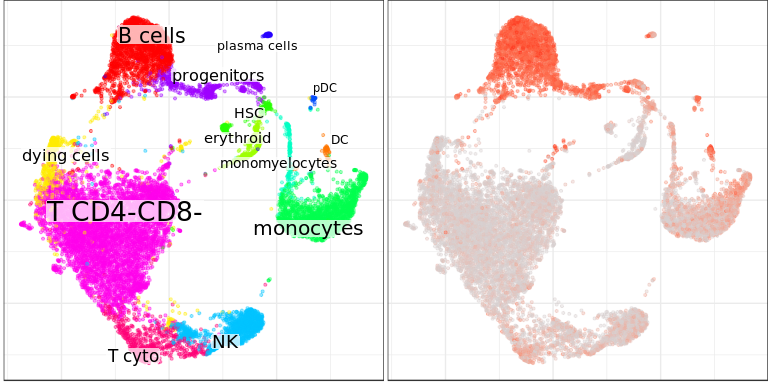<!-- -->

In addition to `getDifferentialGenes` estimates
[specificity](https://en.wikipedia.org/wiki/Sensitivity_and_specificity),
[precision](https://en.wikipedia.org/wiki/Precision_and_recall),
expression fraction (sum expression of the gene within the cluster
divided by the total expression of this gene). If `append.auc` flag is
set, it can estimate [ROC
AUC](https://en.wikipedia.org/wiki/Receiver_operating_characteristic#Area_under_the_curve),
but it can take some time. To find the most meaningful markers, it’s
recommended to filter the data by some lower value for AUC and then
order the results by Z-score or
precision.

``` r
de.info$monocytes %>% filter(AUC > 0.75) %>% arrange(-Precision) %>% head()
```

    ##       Gene        M        Z        PValue          PAdj       AUC
    ## 1     CD14 3.231546 15.50441  2.520960e-53  8.465888e-49 0.7702102
    ## 2 SERPINA1 3.228138 21.10589  7.426641e-98  2.498990e-93 0.8833554
    ## 3    RAB31 3.089283 13.86084  7.619598e-43  2.556985e-38 0.7845012
    ## 4     CSTA 3.110447 23.86952 7.592441e-125 2.556906e-120 0.9107458
    ## 5     FCN1 3.172066 26.74712 1.786229e-156 6.016911e-152 0.9514647
    ## 6     G0S2 3.172698 16.27406  1.231885e-58  4.138147e-54 0.7984214
    ##   Specificity Precision ExpressionFraction
    ## 1   0.9919610 0.9125737          0.5490544
    ## 2   0.9836050 0.8834111          0.7836879
    ## 3   0.9849228 0.8564014          0.5851064
    ## 4   0.9763459 0.8512790          0.8457447
    ## 5   0.9712175 0.8401705          0.9320331
    ## 6   0.9810150 0.8338658          0.6170213

``` r
con$plotGraph(gene="CD14")
```

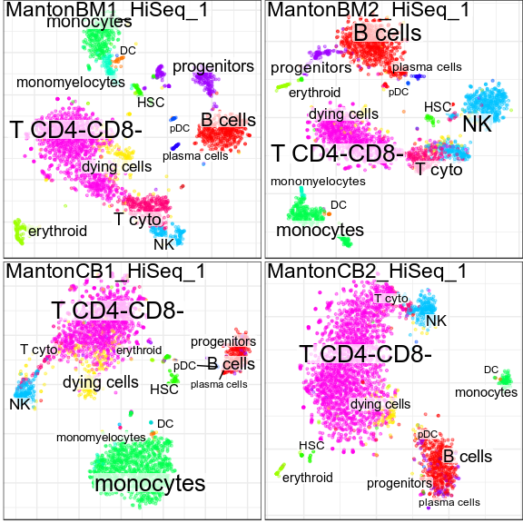<!-- -->

Or plot a heatmap of top genes (top by AUC by
default)

``` r
plotDEheatmap(con,new.annot,de.info, n.genes.per.cluster = 5, column.metadata=list(samples=con$getDatasetPerCell()), row_names_gp = grid::gpar(fontsize = 7))
```

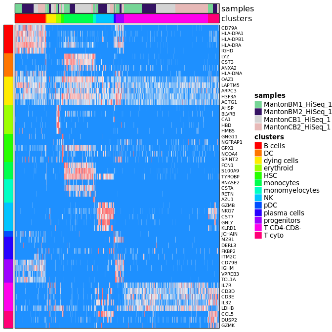<!-- -->

Make a smaller heatmap, selecting a subset of cell types, and showing
only hand-picked set of
genes:

``` r
gns <- c("GZMB","IL32","CD3E","LYZ","HLA-DRA","IGHD","GNLY","IGHM","GZMK")
plotDEheatmap(con,new.annot,de.info[-c(3,10)], n.genes.per.cluster = 30, column.metadata=list(samples=con$getDatasetPerCell()), row_names_gp = grid::gpar(fontsize = 7), labeled.gene.subset = gns)
```

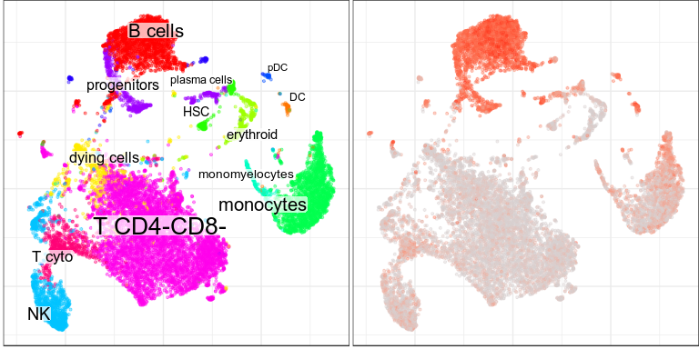<!-- -->

## DE Between Sample Groups

Next, given a joint clustering of cells that captures cell relationships
between samples, we can want to ask what is different between the cells
of these populations between specific samples types, in this case CB and
BM samples. Conos provides routines to be able to do that.

The general approach we suggest for differential expression analysis, is
to first pool all the data associated with each cluster (forming a
meta-cell that is analogous bulk RNA-seq measurement of the cells within
each cluster), and then use standard differential expression packages,
such as DESeq2 or limma to compare these “bulk-like” meta-cell samples,
using appropriate design models. In this section we show a convenience
routine (`getPerCellTypeDE`) that enables one type of comparison (same
cluster, between sample groups), but if more advanced models are desired
(e.g. additional model variables, etc.) `getClusterCountMatrices`
command can be used to obtain the meta-cell counts:

``` r
str( con$getClusterCountMatrices() , 1)
```

    ## List of 4
    ##  $ MantonBM1_HiSeq_1: num [1:33694, 1:13] 0 0 0 1 0 0 0 0 40 4 ...
    ##   ..- attr(*, "dimnames")=List of 2
    ##  $ MantonBM2_HiSeq_1: num [1:33694, 1:13] 0 0 0 0 0 0 0 0 63 4 ...
    ##   ..- attr(*, "dimnames")=List of 2
    ##  $ MantonCB1_HiSeq_1: num [1:33694, 1:13] 0 0 0 0 0 0 0 0 77 6 ...
    ##   ..- attr(*, "dimnames")=List of 2
    ##  $ MantonCB2_HiSeq_1: num [1:33694, 1:13] 0 0 0 0 0 0 0 0 133 18 ...
    ##   ..- attr(*, "dimnames")=List of 2

The list above, returns pooled count matrix for each sample, where the
rows are genes, and columns are clusters. Different groups parameter can
be supplied.

Back to DE analysis of the cluster states between groups of samples.
First we need to define our sample groups

``` r
samplegroups <- list(
  bm = c("MantonBM1_HiSeq_1","MantonBM2_HiSeq_1"),
  cb = c("MantonCB1_HiSeq_1","MantonCB2_HiSeq_1")
)
```

### Simple run

We can then run differential expression between cells in these sample
groups:

``` r
de.info <- getPerCellTypeDE(con, groups=as.factor(new.annot), sample.groups = samplegroups, ref.level='bm', n.cores=4)
```

…and examine the output

``` r
str(de.info[1:3], 2)
```

    ## List of 3
    ##  $ B cells    :List of 3
    ##   ..$ res          :'data.frame':    33694 obs. of  6 variables:
    ##   ..$ cm           : num [1:33694, 1:4] 0 0 0 1 0 0 0 0 22 1 ...
    ##   .. ..- attr(*, "dimnames")=List of 2
    ##   ..$ sample.groups:List of 2
    ##  $ DC         : logi NA
    ##  $ dying cells:List of 3
    ##   ..$ res          :'data.frame':    33694 obs. of  6 variables:
    ##   ..$ cm           : num [1:33694, 1:4] 0 0 0 0 0 0 0 0 9 1 ...
    ##   .. ..- attr(*, "dimnames")=List of 2
    ##   ..$ sample.groups:List of 2

Let’s look at the results for the B cells

``` r
res <- de.info[['B cells']]$res
head(res[order(res$padj,decreasing = FALSE),])
```

    ##                baseMean log2FoldChange     lfcSE      stat       pvalue
    ## RP11-386I14.4 633.00092       3.590611 0.2906414 12.354092 4.629512e-35
    ## HBA2          440.35042       3.378324 0.3707656  9.111752 8.106231e-20
    ## CH17-373J23.1 440.57697       3.406280 0.3884377  8.769179 1.799740e-18
    ## CD69          627.05296       2.480220 0.2966294  8.361342 6.200897e-17
    ## IGHA1          94.44757      -6.211823 0.7615539 -8.156773 3.440928e-16
    ## HMGB2         175.18363      -3.126746 0.4015545 -7.786606 6.883331e-15
    ##                       padj
    ## RP11-386I14.4 7.252131e-31
    ## HBA2          6.349206e-16
    ## CH17-373J23.1 9.397643e-15
    ## CD69          2.428426e-13
    ## IGHA1         1.078043e-12
    ## HMGB2         1.797123e-11

# Forcing better alignment

As can be seen from the sample distribution plot, different samples, in
particular those reprsenting different tissues (BM or CB) form separate
subclusters within the clusters of major cell types. Conos allows to
force better alignment through i) adjustment of the `alignment.strength
parameter`, and ii) through rebalancing of edge weights based on a
specific factor (e.g. tissue to which the cell belongs) using
`balance.edge.weights`
parameter.

``` r
con$buildGraph(k=15, k.self=5, alignment.strength=0.3, space='PCA', ncomps=30, n.odgenes=2000, matching.method='mNN', metric='angular', score.component.variance=TRUE, verbose=TRUE)
```

    ## found 6 out of 6 cached PCA  space pairs ...  done
    ## inter-sample links using  mNN   done
    ## local pairs local pairs  done
    ## building graph ..done

re-generate the embedding and visualize the sample distribution
again:

``` r
con$embedGraph()
```

    ## Estimating embeddings.

``` r
con$plotGraph(color.by='sample', mark.groups=F, alpha=0.1, show.legend=T)
```

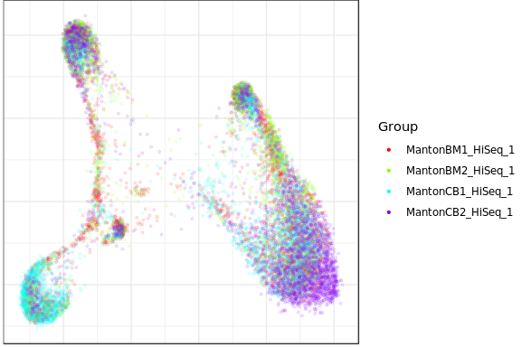<!-- -->

We can also check the entropy:

``` r
con$findCommunities()
plotClusterBarplots(con, legend.height = 0.1)
```

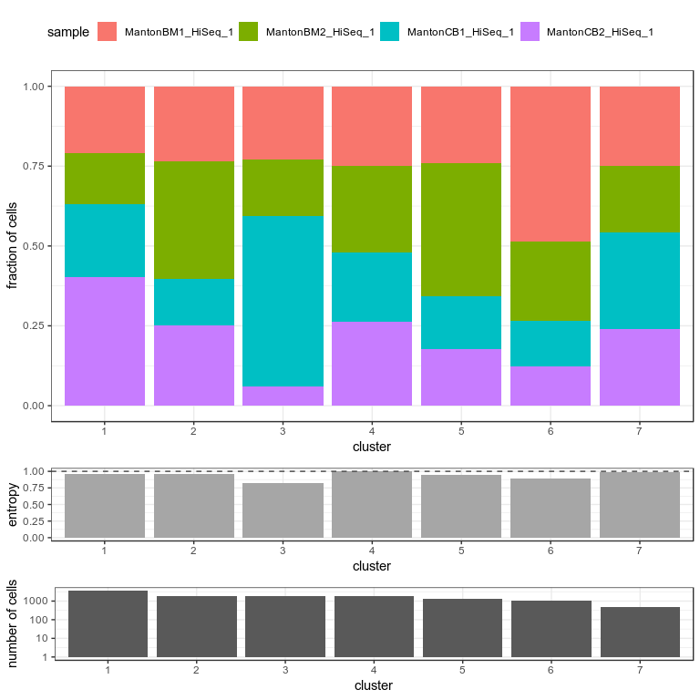<!-- -->
